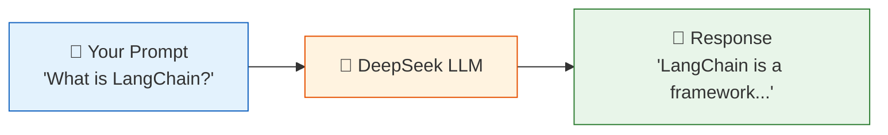
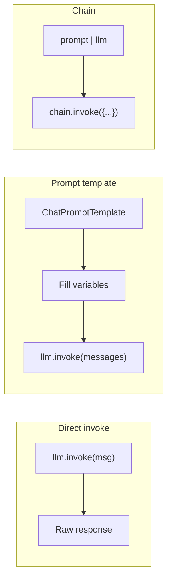
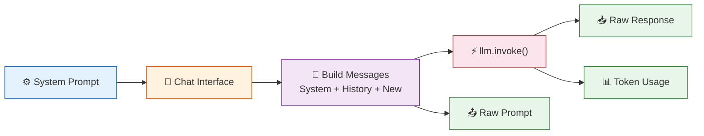
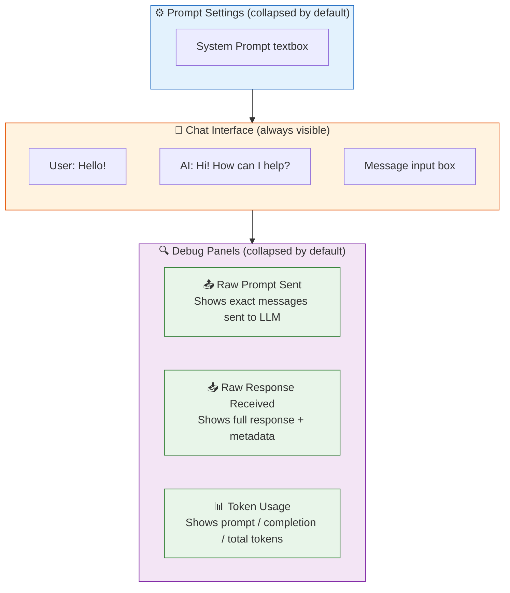

# 01 — Hello LLM

## What is an LLM call?

An LLM (Large Language Model) takes text input (a **prompt**) and returns text output (a **completion**). LangChain wraps this in a unified interface so you can swap models without rewriting your code.



## What you'll learn

- `ChatOpenAI` — the standard interface for chat models
- `.invoke()` — send a message and get a response
- Why LangChain exists: one API for many LLMs

## The code

`main.py` shows three styles of calling DeepSeek:



1. **Direct invoke** — simplest, just ask and print
2. **Prompt template** — inject variables into a reusable prompt
3. **Chain** — combine prompt + model into one callable

## Interactive Testing with Gradio

`main_gr.py` gives you a web UI to experiment interactively:

```bash
python 01_hello_llm/main_gr.py
# then open http://localhost:7860
```

### What you can do

| Section | What it shows |
|---------|---------------|
| **⚙️ Prompt Settings** (collapsible) | Set the **system prompt** before chatting |
| **💬 Chat** (always visible) | Type messages, see AI responses |
| **📤 Raw Prompt** (collapsible) | The **exact messages** object sent to the LLM — every `[SystemMessage]`, `[HumanMessage]`, `[AIMessage]` with full content |
| **📥 Raw Response** (collapsible) | The **full response object** including `content` and `response_metadata` |
| **📊 Token Usage** (collapsible) | Prompt tokens, completion tokens, and total (when the provider returns them) |

### Data flow



## Gradio UI Layout

Here is what the interface looks like when you open `http://localhost:7860`:



## Try it yourself

Edit the `topic` variable in `main.py` to ask about different things, or launch `main_gr.py` to experiment freely.
