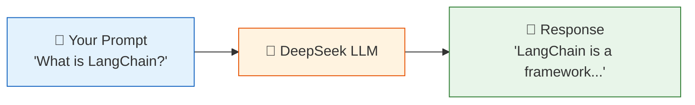
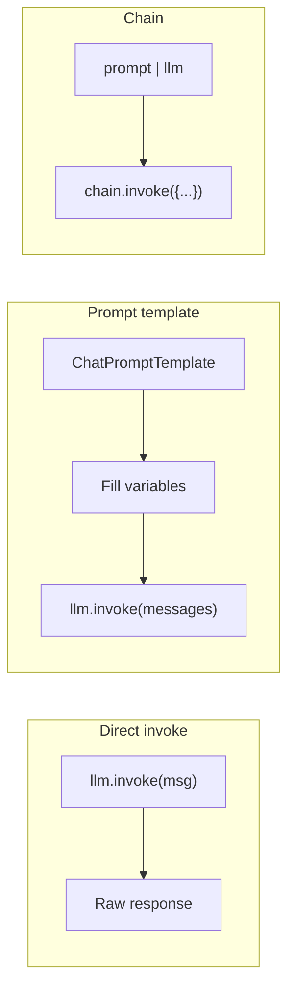

# 01 — Hello LLM

## What is an LLM call?

An LLM (Large Language Model) takes text input (a **prompt**) and returns text output (a **completion**). LangChain wraps this in a unified interface so you can swap models without rewriting your code.

## What you'll learn

- `ChatOpenAI` — the standard interface for chat models
- `.invoke()` — send a message and get a response
- Why LangChain exists: one API for many LLMs

## The code

`main.py` shows three styles of calling DeepSeek:

1. **Direct invoke** — simplest, just ask and print
2. **Prompt template** — inject variables into a reusable prompt
3. **Chain** — combine prompt + model into one callable

## Try it yourself

Edit the `topic` variable to ask about different things.
