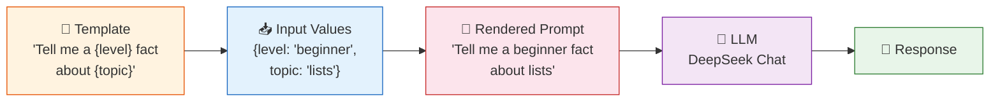
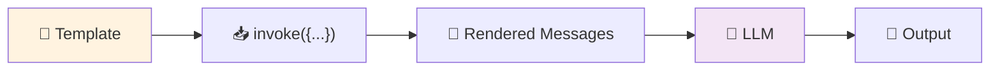
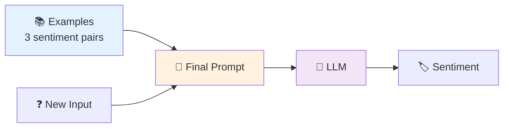

# 02 — Prompt Templates

## What are Prompt Templates?

A **prompt template** is a reusable blueprint for your LLM prompt. Instead of hard-coding every message, you define a structure with `{placeholders}` and fill them in later with dynamic values (user names, topics, languages, etc.).

## Visual Flow



## What You'll Learn

| Class | What It Does |
|-------|-------------|
| `ChatPromptTemplate` | Builds multi-message prompts (system + human + AI) using role tuples |
| `PromptTemplate` | Simpler single-string template — good for one-shot text generation |
| `FewShotChatMessagePromptTemplate` | Adds example input/output pairs so the model learns by imitation |

## Code Walkthrough

### 1. ChatPromptTemplate (multi-message)

```python
chat_template = ChatPromptTemplate.from_messages([
    ("system", "You are a {role} expert."),
    ("human", "Tell me a {level} fact about {topic}."),
])
```

**What it does:** Creates a 2-message prompt — a system message that sets the AI's persona + a human message with the actual request. The `{role}`, `{level}`, `{topic}` are placeholders filled at runtime.

**Chain flow:**


### 2. String PromptTemplate (simpler)

```python
string_template = PromptTemplate.from_template(
    "Translate this to {language}: {text}"
)
```

**What it does:** A lightweight template for single-turn text transformation. No system message, no roles — just a string with placeholders.

### 3. Few-Shot Prompting

```python
examples = [
    {"input": "LangChain is hard", "sentiment": "negative"},
    {"input": "I love Python", "sentiment": "positive"},
]
```

**What it does:** Shows the model 3 labeled examples before asking it to classify new text. The model learns the pattern (input → sentiment) from the examples, no fine-tuning needed.

**Visual:**


## Key Concept: The `|` Operator (LCEL)

```python
chain = chat_template | llm
```

The `|` (pipe) chains components together. Data flows: **Prompt → LLM**. LangChain calls this **LCEL** (LangChain Expression Language). It's the modern way to build chains.

## Summary

- Use `ChatPromptTemplate` for multi-role conversations
- Use `PromptTemplate` for simple string templates
- Use `FewShotChatMessagePromptTemplate` to teach by example
- Fill placeholders with `.invoke({"var": "value"})`
- Chain with `|` for clean, composable pipelines
