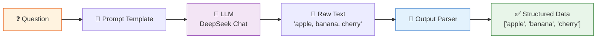
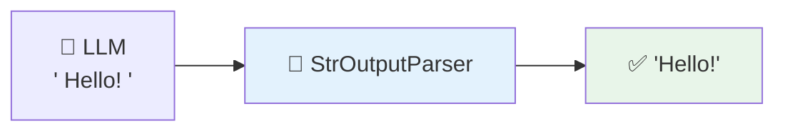
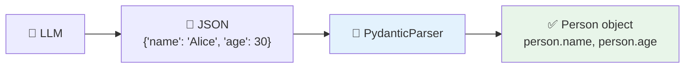

# 03 — Output Parsers

## What are Output Parsers?

LLMs return **raw text**. When you need structured data — a Python list, a JSON object, a validated dataclass — you need a **parser** to convert the text into a usable format.

## Visual Flow



## What You'll Learn

| Parser | Input → Output | When to Use |
|--------|---------------|-------------|
| `StrOutputParser` | Raw text → Clean string | Default — strips whitespace, cleans up |
| `CommaSeparatedListOutputParser` | `"a, b, c"` → `["a", "b", "c"]` | When the model lists items |
| `PydanticOutputParser` | JSON text → Python object | When you need validated, typed data |

## Code Walkthrough

### 1. StrOutputParser (simplest)

```python
parser = StrOutputParser()
chain = ChatPromptTemplate(...) | llm | parser
```

**What it does:** Takes the LLM's response and strips any extra whitespace/newlines. Returns a clean string. It's the default parser for most chains.

**Flow:**


### 2. CommaSeparatedListOutputParser

```python
parser = CommaSeparatedListOutputParser()
```

**What it does:** Tells the model to output items separated by commas, then splits them into a Python list. It automatically adds `{format_instructions}` to the prompt so the model knows the expected format.

| Before (raw text) | After (parsed) |
|---|---|
| `"Python, JavaScript, Rust"` | `["Python", "JavaScript", "Rust"]` |

### 3. PydanticOutputParser (most powerful)

```python
class Person(BaseModel):
    name: str = Field(description="The person's full name")
    age: int = Field(description="The person's age")

parser = PydanticOutputParser(pydantic_object=Person)
```

**What it does:** Defines a **schema** using Pydantic. The parser tells the model to output JSON matching this schema, then validates and converts it into a typed `Person` object with fields you access via `.name`, `.age`, etc.

**Why it matters:** Type safety + validation. If the LLM outputs `"age": "old"` (a string instead of int), the parser raises an error.



## Key Concept: Why Parse?

Without a parser, `response.content` is just a string. To use the output in your code (filtering, sorting, storing in a DB), you need it in the right format. Parsers automate this conversion.

## Summary

| You want... | Use... |
|-------------|--------|
| Just the text | `StrOutputParser` |
| A list of items | `CommaSeparatedListOutputParser` |
| A validated object | `PydanticOutputParser` |
