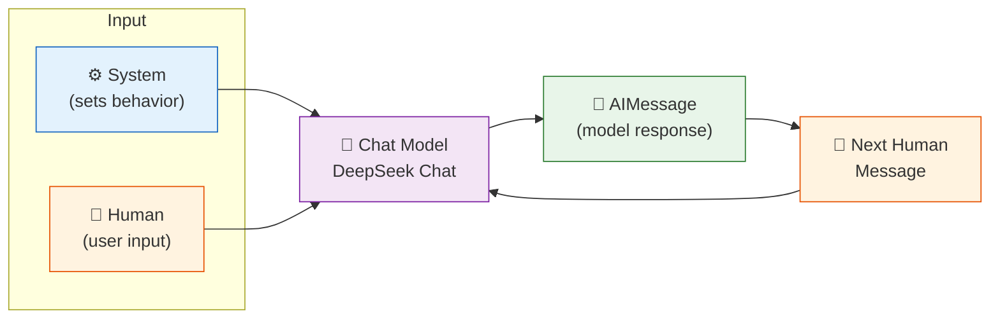
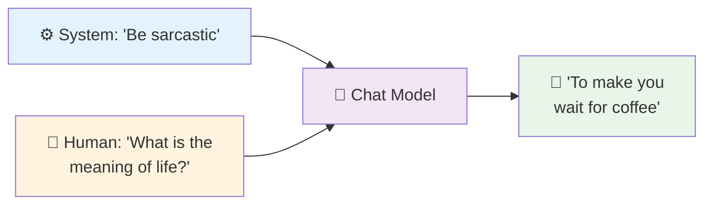
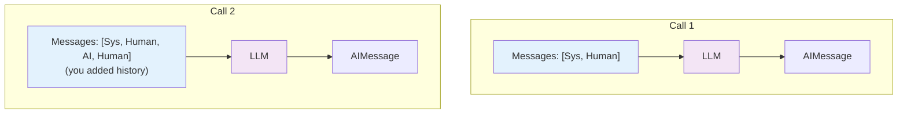

# 04 — Chat Models

## LLMs vs Chat Models

| Old LLM (legacy) | Chat Model (modern) |
|------------------|---------------------|
| Input: one plain string | Input: a **list of messages** with roles |
| One role: user | Three roles: **system**, **human**, **AI** |
| No conversation structure | Built-in role system for context |

DeepSeek (like GPT) is a **chat model**. You send structured messages, each with a role label.

## Visual: How Chat Messages Work



## What You'll Learn

| Concept | What It Does |
|---------|-------------|
| `SystemMessage` | Sets the AI's behavior/tone — only sent once at the start |
| `HumanMessage` | Represents user input in the conversation |
| `AIMessage` | Stores the model's response — you feed it back for multi-turn chat |
| `ChatPromptTemplate` | A convenient way to build message lists from tuples |

## Code Walkthrough

### 1. Role-Based Messages (single turn)

```python
messages = [
    SystemMessage("You are a sarcastic assistant."),
    HumanMessage("What is the meaning of life?"),
]
response = llm.invoke(messages)
```

**What it does:** Sends exactly 2 messages — system sets the personality, human asks the question. The model replies with an `AIMessage`.

**Flow:**


### 2. Multi-Turn Conversation (maintaining history)

```python
messages = [SystemMessage("You are a math tutor."), HumanMessage("What is 12 × 15?")]
response = llm.invoke(messages)

messages.append(AIMessage(response.content))   # add model's answer
messages.append(HumanMessage("Now explain step by step."))
response = llm.invoke(messages)                # send full history
```

**Key insight:** Chat models are **stateless**. They don't remember past conversations. **You** must keep the message list and send the full history every time. Each `invoke()` is independent.

### 3. ChatPromptTemplate → Messages

```python
prompt = ChatPromptTemplate.from_messages([
    ("system", "You speak like a {era} philosopher."),
    ("human", "Share your thoughts on {topic}."),
])
messages = prompt.invoke({"era": "Ancient Greek", "topic": "technology"})
```

**What it does:** A shortcut. Instead of manually creating `SystemMessage(...)` and `HumanMessage(...)`, you write tuples `(role, content)` with placeholders. The template fills in the values and returns a ready-to-send list of messages.

## Key Concept: Statelessness



Each LLM call is standalone. If you don't send the history, the model forgets everything from the last turn.

## Summary

- **System message** controls the AI's behavior
- **Human + AI messages** form the conversation turns
- **You** store and send the history — LangChain doesn't do it automatically
- Use `ChatPromptTemplate` for convenience
- Lesson 06 (Memory) automates history management
