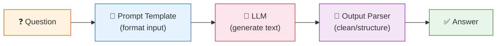
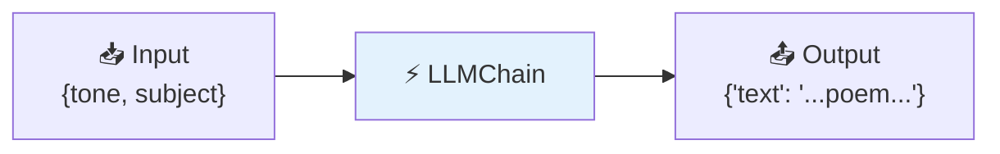
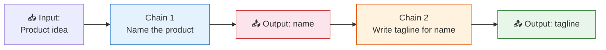
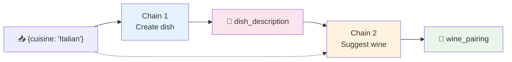

# 05 — Chains

## What is a Chain?

A **chain** links multiple steps together into a pipeline. Data flows through each step, and the output of one step becomes the input of the next.

**The simplest chain:** Prompt → Model → Parser



## What You'll Learn

| Chain Type | What It Does | Visual |
|------------|-------------|--------|
| `LLMChain` | Classic prompt → model wrapper | Single step |
| `SimpleSequentialChain` | Chain A's output → Chain B's input | **Linear** pipeline |
| `SequentialChain` | Multiple inputs/outputs between chains | **Multi-wire** pipeline |

## Modern vs Classic

Newer LangChain (≥0.3) prefers **LCEL** (`|` operator) over these chain classes. Both are shown here so you recognize older code. The concepts are the same.

## Code Walkthrough

### 1. LLMChain — The Basic Building Block

```python
prompt = ChatPromptTemplate.from_messages([
    ("human", "Write a short {tone} poem about {subject}."),
])
chain = LLMChain(llm=llm, prompt=prompt)
response = chain.invoke({"tone": "funny", "subject": "a penguin learning to code"})
```

**What it does:** Wraps a prompt + LLM into one callable object. Input is a dict of variables, output is a dict with a `"text"` key.



### 2. SimpleSequentialChain — One After Another

```python
chain_1 = LLMChain(llm=llm, prompt=name_prompt, output_key="name")
chain_2 = LLMChain(llm=llm, prompt=tagline_prompt, output_key="tagline")
seq_chain = SimpleSequentialChain(chains=[chain_1, chain_2])
result = seq_chain.invoke("cat-themed coffee shop")
```

**What it does:** Runs chain_1, takes its output, feeds it as input to chain_2. The output of chain_1 is automatically piped into chain_2.

**Flow:**


### 3. SequentialChain — Multiple Inputs & Outputs

```python
chain_1 = LLMChain(llm=llm, prompt=dish_prompt, output_key="dish_description")
chain_2 = LLMChain(llm=llm, prompt=wine_prompt, output_key="wine_pairing")

multi_chain = SequentialChain(
    chains=[chain_1, chain_2],
    input_variables=["cuisine"],
    output_variables=["dish_description", "wine_pairing"],
)
```

**What it does:** Like `SimpleSequentialChain`, but you control which variables flow where. Chain 2 can use chain_1's `dish_description` output while the original `cuisine` input is preserved.



## Key Concept: What Problem Do Chains Solve?

Without chains, you'd write:
```python
prompt_output = prompt.format(...)
llm_output = llm.invoke(prompt_output)
parsed = parser.parse(llm_output)
```

Chains wrap this into a single `.invoke()` call and add pipeline capabilities (multiple steps, pass data between steps). **LCEL** (Lesson 13) is the modern evolution of this idea.

## Summary

| Chain | Best for |
|-------|---------|
| `LLMChain` | Single prompt → LLM step |
| `SimpleSequentialChain` | Linear A→B→C pipeline |
| `SequentialChain` | Complex multi-variable flows |
| LCEL (`\|`) | Modern, cleaner alternative to all of the above |
