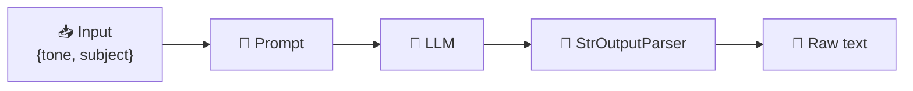
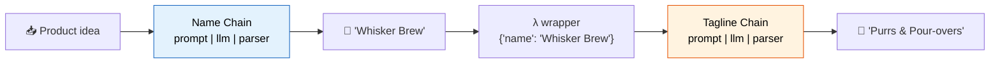
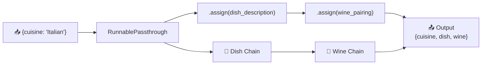

# 05 — Chains

## What is a Chain?

A **chain** links multiple steps together into a pipeline. Data flows through each step, and the output of one step becomes the input of the next.

**The simplest chain:** Prompt → Model → Parser


## Modern Approach: LCEL (`|`)

Modern LangChain uses the `|` operator to build chains — no special classes needed.

```python
chain = prompt | llm | StrOutputParser()
```

This is **LCEL** (LangChain Expression Language). Everything you can `|` together automatically supports `.invoke()`, `.stream()`, `.batch()`, and `.ainvoke()`.

## What You'll Learn

| Pattern | LCEL Code | What It Does |
|---------|-----------|-------------|
| Basic chain | `prompt \| llm \| parser` | Single prompt → LLM → output |
| Sequential | `chain1 \| chain2` | Pipe output of one chain into another |
| Multi-output | `RunnablePassthrough.assign(...)` | Generate multiple outputs from one input |

## Code Walkthrough

### 1. Basic Chain — `prompt | llm | parser`

```python
chain = prompt | llm | StrOutputParser()
response = chain.invoke({"tone": "funny", "subject": "a penguin learning to code"})
```

**What it does:** The prompt formats the variables, the LLM generates text, the parser extracts the string.



### 2. Sequential Chain — `chain1 | chain2`

Two independent chains connected in series. The output of chain 1 flows into chain 2.

```python
name_chain = name_prompt | llm | StrOutputParser()
tagline_chain = tagline_prompt | llm | StrOutputParser()

# Connect them
seq_chain = name_chain | (lambda name: {"name": name}) | tagline_chain
result = seq_chain.invoke("cat-themed coffee shop")
```

**Flow:**



### 3. Multi-Output Chain — `RunnablePassthrough.assign()`

Generate multiple outputs from a single input using `.assign()`.

```python
chain = (
    RunnablePassthrough.assign(
        dish_description=dish_chain
    )
    | RunnablePassthrough.assign(
        wine_pairing=wine_chain
    )
)
result = chain.invoke({"cuisine": "Italian"})
# result = {"cuisine": "Italian", "dish_description": "...", "wine_pairing": "..."}
```

**Flow:**



## Key Concept: Everything is a Runnable

In modern LangChain, every component is a **Runnable**:
- `prompt` → Runnable
- `llm` → Runnable
- `parser` → Runnable
- `lambda` → RunnableLambda (automatically wrapped)

This means they all support: `.invoke()`, `.stream()`, `.batch()`, `.ainvoke()`.

## Summary

| Pattern | LCEL | Best For |
|---------|------|---------|
| Single step | `prompt \| llm` | One-shot Q&A |
| Sequential | `chain1 \| wrapper \| chain2` | Linear pipelines |
| Multi-output | `RunnablePassthrough.assign(...)` | Complex workflows |
| Parallel | `RunnableParallel(a=..., b=...)` | Independent tasks |

**Modern LangChain (≥0.3) uses LCEL exclusively.** See lesson 13 for a deep dive.
