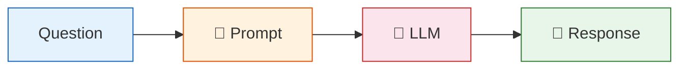
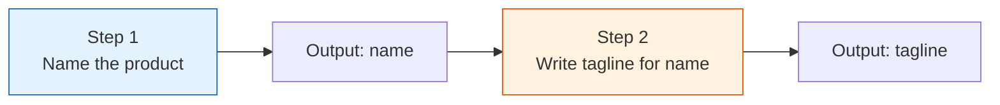
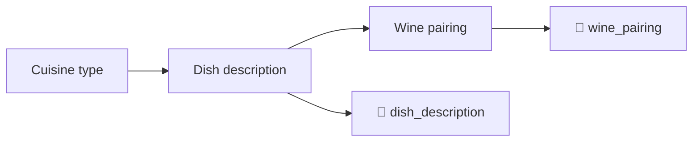

# 05 — Chains

## What is a chain?

A chain links multiple steps together: prompt → model → parser. LangChain provides pre-built chains for common patterns.

## What you'll learn

- `LLMChain` — the classic prompt → model wrapper
- `SimpleSequentialChain` — run chains one after another, passing output as input

- `SequentialChain` — multi-input / multi-output chains

## Modern vs Classic

Newer LangChain (≥0.3) prefers **LCEL** (`|` operator) over chain classes. Both are shown here so you recognize older code when you see it.
