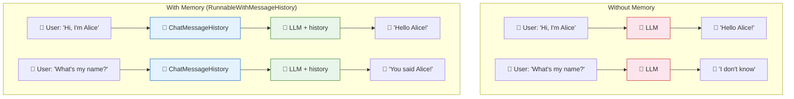
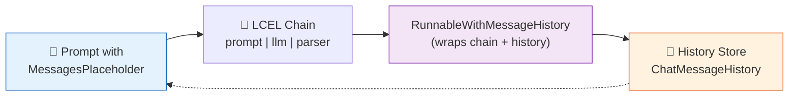
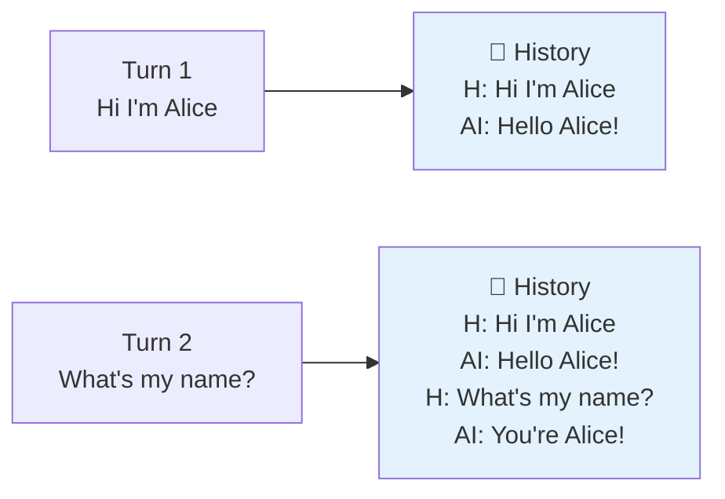
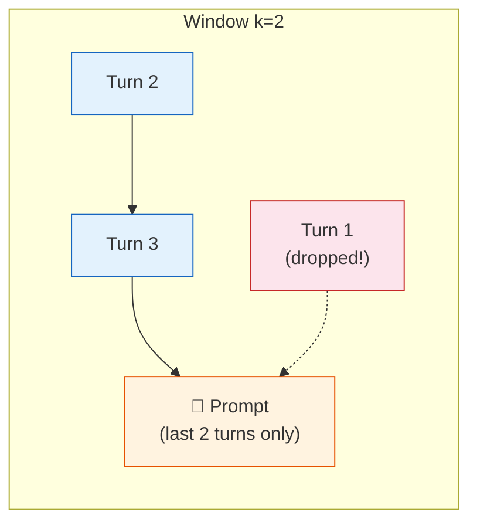
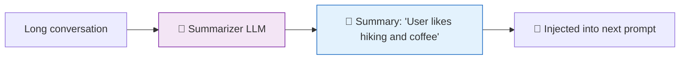
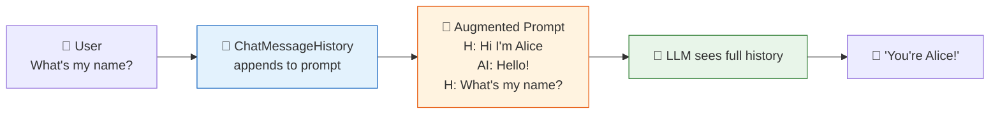

# 06 — Memory

## Why Memory?

**LLMs are stateless** — they don't remember past turns. Every `invoke()` is a fresh conversation. **Memory** gives your chain a recollection of the conversation so far by injecting history into the prompt.

## Visual: How Memory Works



## What You'll Learn

| Memory Type | What It Stores | When to Use |
|-------------|---------------|-------------|
| `ChatMessageHistory` + `RunnableWithMessageHistory` | Full conversation transcript | Short chats, small contexts |
| Custom `WindowedChatMessageHistory` | Only the last N messages | Long conversations (saves tokens) |
| Manual summarization | AI-generated summary of old messages | Very long conversations |

## Modern Pattern: MessagesPlaceholder + RunnableWithMessageHistory

The modern LangChain way uses two pieces working together:



### Step 1: Add a history slot in your prompt

```python
from langchain_core.prompts import MessagesPlaceholder

prompt = ChatPromptTemplate.from_messages([
    ("system", "You are a helpful assistant."),
    MessagesPlaceholder(variable_name="history"),  # ← history injected here
    ("human", "{input}"),
])
```

### Step 2: Build an LCEL chain

```python
chain = prompt | llm | StrOutputParser()
```

### Step 3: Wrap with RunnableWithMessageHistory

```python
from langchain_core.runnables.history import RunnableWithMessageHistory
from langchain_community.chat_message_histories import ChatMessageHistory

store = {}

def get_session(session_id: str):
    if session_id not in store:
        store[session_id] = ChatMessageHistory()
    return store[session_id]

chain_with_history = RunnableWithMessageHistory(
    chain,
    get_session,
    input_messages_key="input",
    history_messages_key="history",
)
```

### Step 4: Invoke with a session ID

```python
chain_with_history.invoke(
    {"input": "Hi, I'm Alice."},
    config={"configurable": {"session_id": "abc123"}},
)
```

## Code Walkthrough

### 1. Buffer Memory — Full History

Uses `ChatMessageHistory` (stores everything). The history grows with every turn.

| Turn | History Size |
|------|-------------|
| 1 | 2 messages (H + AI) |
| 2 | 4 messages |
| N | N × 2 messages |



### 2. Window Memory — Sliding Window

Custom `WindowedChatMessageHistory` keeps only the last `k` exchanges. Older messages are dropped.

```python
class WindowedChatMessageHistory(ChatMessageHistory):
    def add_message(self, message):
        super().add_message(message)
        pairs = self.k * 2
        if len(self.messages) > pairs:
            self.messages = self.messages[-pairs:]
```



### 3. Summary Memory — Manual Summarization

No built-in class for this in modern LangChain (it was removed). Instead, use a second LLM call to summarize periodically and feed the summary into the next prompt.



## Key Concept: History is Just Prompt Injection

Memory works by **modifying the prompt**. Before your message reaches the LLM, the history is injected via `MessagesPlaceholder`. The LLM never "remembers" — it just gets a longer prompt that includes past context.



## Summary

| Memory | Implementation | Tokens Used | Best For |
|--------|---------------|-------------|----------|
| Buffer | `ChatMessageHistory` | Grows forever | Short chats, demo |
| Window | Custom `WindowedChatMessageHistory(k)` | Fixed (k × message size) | Customer support |
| Summary | Manual LLM summarization | Compressed | Long-running conversations |

**Rule of thumb:** Start with `ChatMessageHistory`. If prompts get too long, switch to windowed or summarization.
