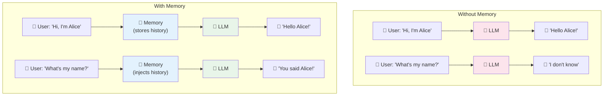
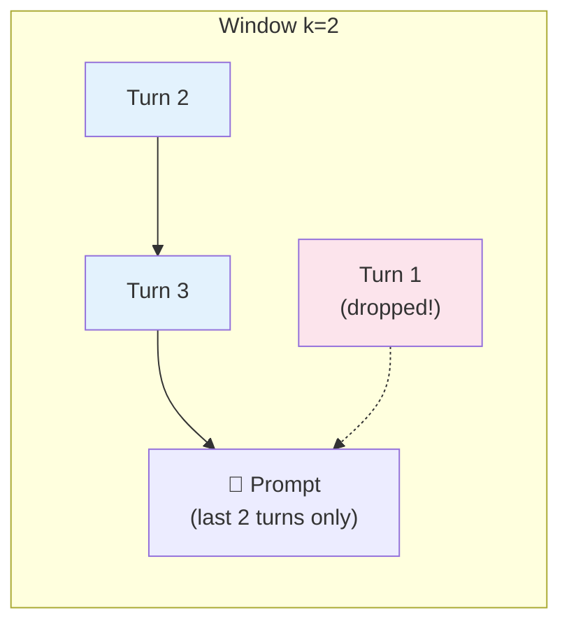
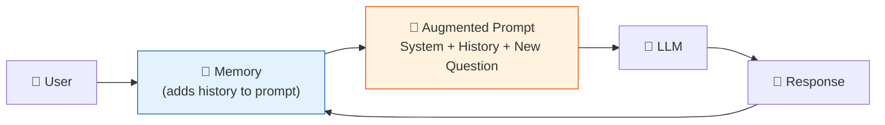

# 06 — Memory

## Why Memory?

**LLMs are stateless** — they don't remember past turns. Every `invoke()` is a fresh conversation. **Memory** gives your chain a recollection of the conversation so far by injecting history into the prompt.

## Visual: How Memory Works



## What You'll Learn

| Memory Type | What It Stores | When to Use |
|-------------|---------------|-------------|
| `ConversationBufferMemory` | Full conversation transcript | Short chats, small contexts |
| `ConversationBufferWindowMemory` | Only the last N messages | Long conversations (saves tokens) |
| `ConversationSummaryMemory` | AI-generated summary of old messages | Very long conversations |
| `ConversationKGMemory` | Knowledge graph triples (entities + relations) | Fact-oriented conversations |

## Code Walkthrough

### 1. ConversationBufferMemory — Full Transcript

```python
memory = ConversationBufferMemory(return_messages=True)
chain = ConversationChain(llm=llm, memory=memory)

chain.invoke("Hi, I'm Alice.")   # → "Hello Alice!"
chain.invoke("What's my name?")  # → "You said your name is Alice!"
```

**What it does:** Every turn, it appends the new exchange to the history. The growing transcript is injected into the prompt. The model sees the entire conversation.

**Memory grows like this:**

| Turn | Stored History |
|------|---------------|
| 1 | Human: "Hi, I'm Alice" → AI: "Hello Alice!" |
| 2 | + Human: "What's my name?" → AI: "You're Alice!" |

### 2. ConversationBufferWindowMemory — Sliding Window

```python
memory = ConversationBufferWindowMemory(k=2, return_messages=True)
#           ^ only remembers last 2 exchanges
```

**What it does:** Keeps only the most recent `k` exchanges. Older messages are dropped. This limits token usage and prevents the prompt from growing infinitely.

**Best for:** Very long conversations where you only need recent context.



### 3. ConversationSummaryMemory — Summarized History

```python
memory = ConversationSummaryMemory(llm=llm, return_messages=True)
```

**What it does:** As the conversation grows, old messages are **summarized** by the LLM into a short paragraph. The summary is injected instead of the full transcript.

**Before:** 20 long exchanges → **After:** "The user likes hiking and coffee, asked about mountains..."

**Best for:** Saving tokens while preserving key information.

## Key Concept: Memory = Prompt Injection

Memory works by **modifying the prompt**. Before your message reaches the LLM, memory injects the history. The LLM never "remembers" — it just gets a longer prompt that includes past context.



## Summary

| Memory | Tokens Used | Best For |
|--------|------------|----------|
| Buffer | Grows forever | Short chats (demo, prototype) |
| Window | Fixed size (k × message size) | Customer support, chatbots |
| Summary | Compressed (summary size) | Long-running conversations |
| KG | Entity triples | Fact extraction, Q&A |

**Rule of thumb:** Start with BufferMemory. If prompts get too long, switch to Window or Summary.
