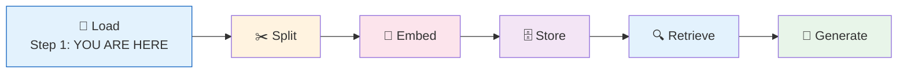
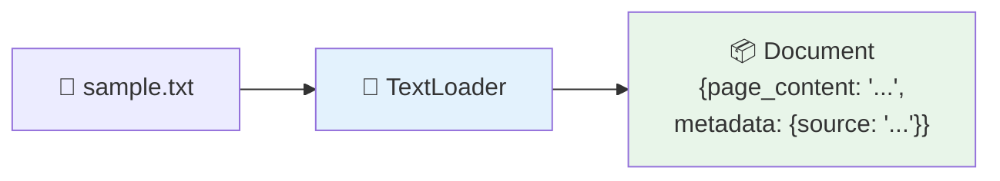

# 07 — Document Loaders

## What are Document Loaders?

Document loaders **ingest** data from various sources (files, web pages, databases) and convert them into LangChain `Document` objects. Each `Document` holds:
- **`page_content`** — the actual text
- **`metadata`** — source info (filename, URL, date, etc.)

## The RAG Pipeline — Step 1

Document loaders are the **first step** in any RAG system:



## What You'll Learn

| Loader | Source | Best For |
|--------|--------|----------|
| `TextLoader` | `.txt` files | Any plain text |
| `CSVLoader` | `.csv` files | Tabular data (spreadsheets) |
| `WebBaseLoader` | HTML URLs | Web scraping |
| `WikipediaLoader` | Wikipedia API | Encyclopedia queries |

## Code Walkthrough

### 1. TextLoader — Plain Text Files

```python
loader = TextLoader("/tmp/sample.txt")
docs = loader.load()
```

**What it does:** Reads a text file and returns one `Document` with the entire file content. Metadata includes the file path.



### 2. CSVLoader — Tabular Data

```python
loader = CSVLoader("/tmp/sample.csv")
docs = loader.load()
```

**What it does:** Reads a CSV file. Each row becomes one `Document`. The `page_content` is a formatted string of all columns.

| CSV Row | Becomes Document |
|---------|-----------------|
| `Alice,30,New York` | `"name: Alice, age: 30, city: New York"` |

### 3. WebBaseLoader — Scrape Web Pages

```python
loader = WebBaseLoader("https://en.wikipedia.org/wiki/LangChain")
docs = loader.load()
```

**What it does:** Fetches a URL, extracts the main text content (strips HTML, navigation, ads). Returns the page text + metadata (title, source URL).

**Requires:** `pip install langchain-community beautifulsoup4`

### 4. WikipediaLoader — Query Wikipedia

```python
loader = WikipediaLoader(query="Python programming language", load_max_docs=1)
docs = loader.load()
```

**What it does:** Uses Wikipedia's API to search for the query and return matching article content. Metadata includes the article title and Wikipedia URL.

## Document Object Breakdown

Each loader returns a list of `Document` objects:

```
Document(
    page_content="LangChain is a framework...",
    metadata={"source": "/tmp/sample.txt"}
)
```

- **`page_content`** — the text you'll split, embed, and search
- **`metadata`** — tracing info (where did this come from?)

## Summary

- Loaders convert external data → LangChain `Document` objects
- Each loader handles a different source type (file, web, API)
- Documents are the **universal data format** for the rest of the pipeline
- RAG starts here: **Load → Split → Embed → Store → Retrieve → Generate**
