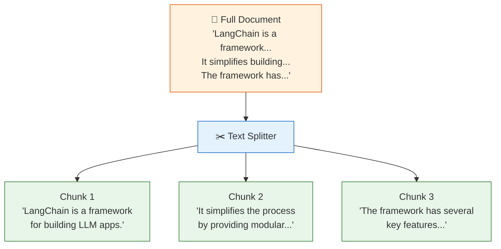
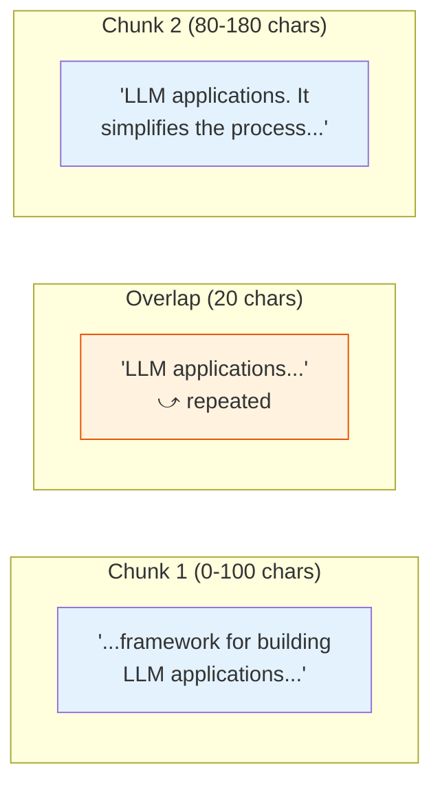

# 08 — Text Splitters

## Why Split Text?

LLMs have **limited context windows** (e.g., 8K–128K tokens). A 100-page PDF won't fit in one prompt. You must break it into smaller **chunks** that are:
- Small enough to fit in the context window
- Large enough to be **self-contained** (meaningful on their own)
- Split at **natural boundaries** (paragraphs, sentences) to preserve meaning

## Visual: Splitting a Document



## What You'll Learn

| Splitter | How It Splits | When to Use |
|----------|--------------|-------------|
| `RecursiveCharacterTextSplitter` | Paragraph → sentence → word (tries largest separator first) | **Default choice** — works for most text |
| `CharacterTextSplitter` | Fixed character count on a single separator | Simple cases, code, log files |

## Key Parameters

| Parameter | What It Does | Example |
|-----------|-------------|---------|
| `chunk_size` | Maximum size of each chunk (in characters or tokens) | `500` |
| `chunk_overlap` | How much adjacent chunks overlap | `50` — prevents cutting a sentence in half |
| `separators` | Priority list of split points | `["\n\n", "\n", ".", " "]` |

## Code Walkthrough

### 1. RecursiveCharacterTextSplitter (Recommended)

```python
splitter = RecursiveCharacterTextSplitter(
    chunk_size=100,
    chunk_overlap=20,
    separators=["\n\n", "\n", ".", " "],
)
chunks = splitter.split_text(text)
```

**What it does:** Tries to split on double-newlines (paragraphs) first. If a paragraph is >100 chars, it falls back to single newlines. Then to sentences (`.`), then to spaces. The overlap ensures no information is lost at chunk boundaries.

**Visual of overlap:**


### 2. CharacterTextSplitter (Simpler)

```python
splitter = CharacterTextSplitter(
    chunk_size=80,
    chunk_overlap=10,
    separator="\n",
)
```

**What it does:** Splits ONLY on newlines. Each chunk is at most 80 characters. If a line is longer than 80 chars, the splitter may exceed the limit (since it only splits on `\n`).

**Use when:** Your text has predictable line breaks (code, logs, lists).

### 3. Splitting Documents (preserving metadata)

```python
docs = [Document(page_content=text, metadata={"source": "manual.md"})]
split_docs = splitter.split_documents(docs)
```

**What it does:** Like `split_text()`, but **preserves metadata**. Each chunk inherits the original document's metadata. This is critical for RAG — you need to know where each chunk came from.

## Key Concept: Chunking Strategy

```
Too small (20 chars)         Too large (2000 chars)         Just right (200-500 chars)
───────────────              ──────────────────             ──────────────────────────
Chunks lack context           Chunks exceed context          Chunks are self-contained
Many chunks to search         Few chunks, low recall         Good balance
Noise from fragmentation      May contain irrelevant info    High relevance
```

## Summary

- **Good chunking** is critical for RAG quality
- Use `RecursiveCharacterTextSplitter` as your default
- Tune `chunk_size` (small = precise, large = contextual)
- Use `chunk_overlap` to avoid cutting sentences in half
- Use `split_documents()` to preserve metadata
