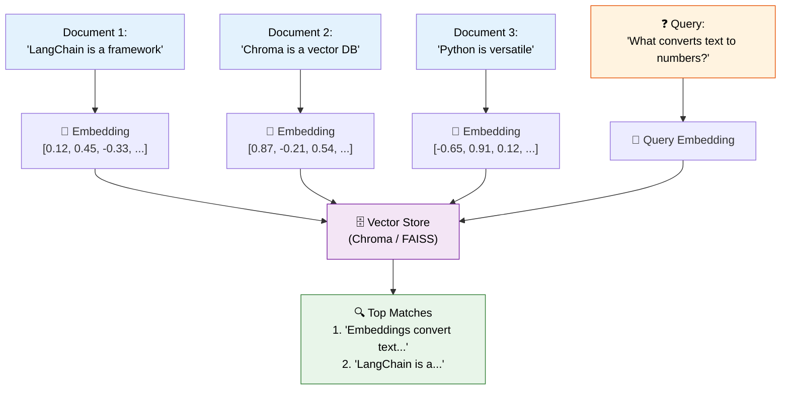
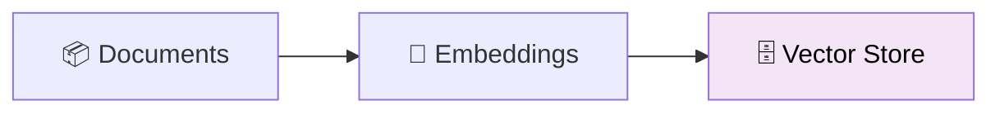

# 09 — Vector Stores

## What are Vector Stores?

Text is converted into **embeddings** — lists of numbers (vectors) that capture the **meaning** of the text. Vector stores index these vectors so you can find documents by **semantic similarity**, not keyword matching.

"Tell me about cars" matches "automobiles" — even though they share no keywords.

## Visual: How Vector Search Works



## What You'll Learn

| Tool | What It Does | When to Use |
|------|-------------|-------------|
| `FakeEmbeddings` | Demo embeddings (no API, no downloads) | Learning / prototyping |
| `Chroma` | Lightweight, in-memory vector store | Zero-setup, small datasets |
| `FAISS` | Facebook's vector search library | Larger datasets, production |
| `similarity_search` | Find closest chunks to a query | Core search operation |

## Code Walkthrough

### 1. Setting Up Embeddings

```python
from langchain_core.embeddings import FakeEmbeddings
embeddings = FakeEmbeddings(size=384)
```

**What it does:** Creates fake embedding vectors (all random). Real embeddings (OpenAI, HuggingFace) convert text to meaningful vectors. `FakeEmbeddings` lets you test the pipeline without API calls.

### 2. Building a Vector Store

```python
documents = [
    Document(page_content="LangChain is a framework for building LLM apps."),
    Document(page_content="Chroma is a vector database for AI applications."),
]
vectorstore = Chroma.from_documents(documents, embeddings)
```

**What it does:** Takes documents, embeds them, and stores the vectors in Chroma (an in-memory DB). Each document becomes a vector index entry.



### 3. Similarity Search

```python
results = vectorstore.similarity_search("What converts text to numbers?", k=2)
```

**What it does:** Embeds the query, then finds the `k` most similar document vectors using cosine similarity (distance between vectors). Returns the actual documents.

### 4. Similarity Search with Score

```python
results = vectorstore.similarity_search_with_score("Python coding", k=2)
# Returns: [(Document, score), ...]  — lower score = more similar
```

**What it does:** Same as above, but also returns a **distance score**. Lower scores mean the vectors are closer (more semantically similar).

### 5. FAISS (Faster for Larger Datasets)

```python
from langchain_community.vectorstores import FAISS
vectorstore = FAISS.from_documents(documents, embeddings)
```

**What it does:** Same API as Chroma, but uses Facebook's **FAISS** library under the hood. FAISS is optimized for large-scale similarity search (millions of vectors).

## Key Concept: Embeddings

An **embedding** converts text into a fixed-size vector (list of floats). Similar texts have similar vectors (close in vector space).

```
"dog" → [0.2, 0.8, -0.1, ...]
"puppy" → [0.22, 0.79, -0.08, ...]  ← close to "dog"
"car" → [-0.5, 0.3, 0.9, ...]        ← far from "dog"
```

## Summary

- **Embeddings** turn text into meaning vectors
- **Vector stores** index these vectors for fast search
- **Similarity search** finds documents by meaning, not keywords
- Use **Chroma** for prototyping, **FAISS** for scale
- Swap `FakeEmbeddings` for real embeddings in production
