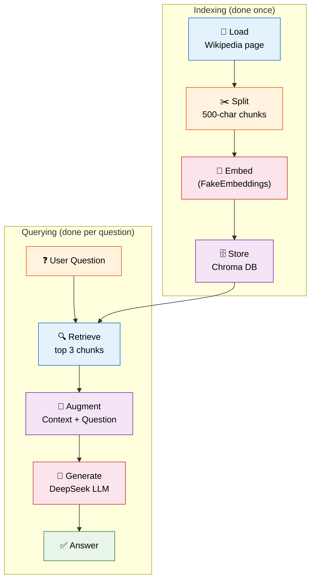
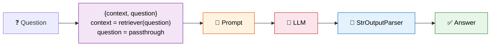

# 10 — RAG (Retrieval-Augmented Generation)

## What is RAG?

RAG lets an LLM answer questions about data it **wasn't trained on**. Instead of relying on the model's internal knowledge, you:

1. **Retrieve** relevant documents from your knowledge base
2. **Augment** the prompt with those documents as context
3. **Generate** an answer based on the context

## The Full Pipeline



## What You'll Learn

- **Full end-to-end RAG pipeline** — Load → Split → Embed → Store → Retrieve → Generate
- **Retriever as a runnable** — `.as_retriever()` wraps the vector store
- **Context augmentation** — inject retrieved docs into the prompt
- **LCEL chain** — the modern way to build pipelines with `|`

## The Code — Step by Step

### Step 1: Load

```python
loader = WebBaseLoader("https://en.wikipedia.org/wiki/LangChain")
docs = loader.load()
```

Downloads the Wikipedia page as a LangChain Document.

### Step 2: Split

```python
splitter = RecursiveCharacterTextSplitter(chunk_size=500, chunk_overlap=50)
chunks = splitter.split_documents(docs)
```

Breaks the page into 500-character chunks with 50 chars of overlap.

### Step 3: Embed & Store

```python
embeddings = FakeEmbeddings(size=384)
vectorstore = Chroma.from_documents(chunks, embeddings)
retriever = vectorstore.as_retriever(search_kwargs={"k": 3})
```

Embeds chunks and indexes them in Chroma. Then wraps the store as a **retriever** that returns the top 3 matches.

### Step 4: Augment (Prompt Design)

```python
template = """Answer the question based ONLY on the following context.
If the context doesn't contain the answer, say "I don't know".

Context:
{context}

Question:
{question}

Answer:"""
```

The prompt tells the LLM: "Here's some data. Answer ONLY from this data."

### Step 5: The Chain (LCEL)

```python
chain = (
    {"context": retriever, "question": RunnablePassthrough()}
    | prompt
    | llm
    | StrOutputParser()
)
```

**What each piece does:**
| Component | What It Does |
|-----------|-------------|
| `{"context": retriever, "question": RunnablePassthrough()}` | Runs retriever on the question to get context, passes question through unchanged |
| `prompt` | Formats context + question into the template |
| `llm` | Sends the formatted prompt to DeepSeek Chat |
| `StrOutputParser()` | Extracts the text from the model's response |



## Why RAG Matters

| Without RAG | With RAG |
|------------|----------|
| LLM guesses from training data | LLM answers from YOUR data |
| Outdated knowledge | Always current (refresh your docs) |
| Can't access private data | Can query internal documents |
| Hallucinates more | Constrained by retrieved context |

## Summary

- RAG = **Retrieve + Augment + Generate**
- The pipeline: **Load → Split → Embed → Store → Retrieve → Generate**
- The retriever finds relevant chunks by semantic similarity
- The LLM answers based ONLY on those chunks
- This is the foundation of most production LLM applications
