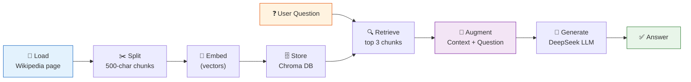

# 10 — RAG (Retrieval-Augmented Generation)

## What is RAG?

RAG = **Retrieve** relevant documents → **Augment** the prompt with them → **Generate** an answer. This lets the LLM answer questions about data it wasn't trained on.

## The pipeline



## What you'll learn

- Full end-to-end RAG pipeline
- Using a retriever as a runnable
- Passing retrieved context into a prompt
- The LCEL pattern

```python
chain = (
    {"context": retriever, "question": RunnablePassthrough()}
    | prompt
    | llm
    | StrOutputParser()
)
```

## Key idea

RAG is the foundation of most production LLM applications — chatbots over your docs, Q&A over codebases, customer support bots.
