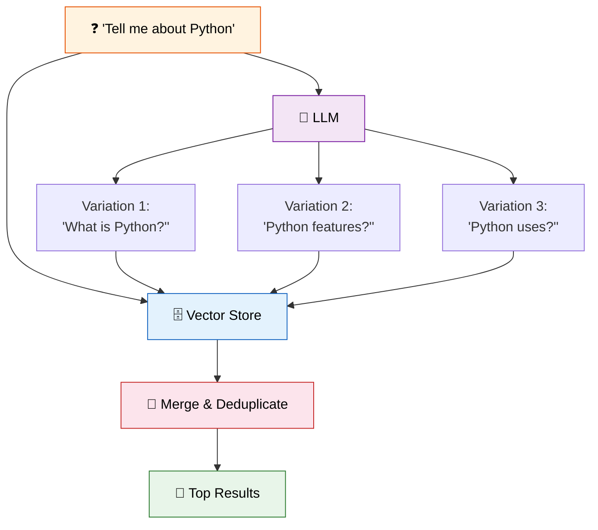
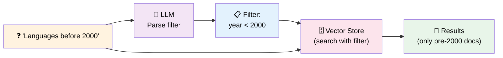
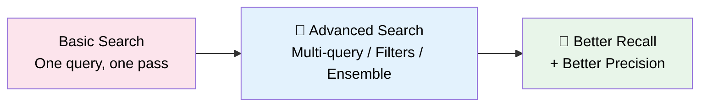

# 11 — Advanced Retrieval

## Why Advanced Retrieval?

Basic similarity search (Lesson 10) works, but has limits:

| Problem | Solution |
|---------|----------|
| User phrases question oddly | **MultiQueryRetriever** — generates question variations |
| Need to filter by metadata | **SelfQueryRetriever** — extracts filters from natural language |
| One retriever isn't enough | **EnsembleRetriever** — combines multiple strategies |

## What You'll Learn

| Retriever | What It Does | Visual |
|-----------|-------------|--------|
| `MultiQueryRetriever` | Asks LLM to rephrase question 3 ways, searches each, merges results | Multiple angles |
| `SelfQueryRetriever` | Parses natural language → metadata filters | "Before 2000" → `year < 2000` |
| `EnsembleRetriever` | Weighted blend of multiple retrievers | Best of both worlds |

## Code Walkthrough

### 1. MultiQueryRetriever — Cover All Angles

```python
retriever = MultiQueryRetriever.from_llm(
    retriever=vectorstore.as_retriever(),
    llm=llm,
)
results = retriever.invoke("Tell me about Python")
```

**What it does:** Takes your question, asks the LLM to generate 3 alternative phrasings, runs all 4 searches (original + 3 variations), and combines the unique results.



**Why it helps:** A user might ask "Tell me about Python" — your documents might use "Python programming" or "Python language". Multiple queries cover different phrasings.

### 2. SelfQueryRetriever — Filter by Metadata

```python
metadata_field_info = [
    AttributeInfo(name="year", description="Year the language was created", type="int"),
    AttributeInfo(name="language", description="Programming language name", type="string"),
]

retriever = SelfQueryRetriever.from_llm(
    llm=llm,
    vectorstore=vectorstore,
    document_contents="Programming languages",
    metadata_field_info=metadata_field_info,
)
results = retriever.invoke("Which languages were created before 2000?")
```

**What it does:** The LLM parses "before 2000" into a filter: `year < 2000`. The retriever applies this filter to the vector search, returning only documents where `year < 2000`.



**Why it matters:** Without SelfQuery, "languages before 2000" would return any document about languages, and you'd need to filter manually. SelfQuery does it in one step.

### 3. EnsembleRetriever — Combine Strategies

```python
from langchain_classic.retrievers import EnsembleRetriever

ensemble = EnsembleRetriever(
    retrievers=[bm25_retriever, vector_retriever],
    weights=[0.3, 0.7],
)
```

*(Concept shown — combines keyword search + vector search with weighted scoring.)*

**What it does:** Runs multiple retrievers, scores each result, and returns the best combined ranking. You control the weight of each strategy.

## Key Concept: Retrieval Quality



The best single retriever is good. **Combining strategies is better.**

## Summary

| Retriever | Use When |
|-----------|----------|
| `MultiQueryRetriever` | Users might phrase questions differently |
| `SelfQueryRetriever` | Your documents have rich metadata (dates, categories) |
| `EnsembleRetriever` | You want the best of keyword + semantic search |
