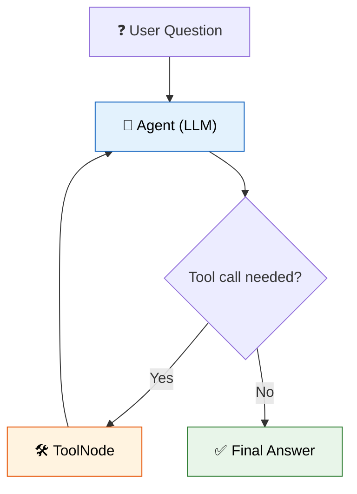

# 12 — Agents with LangGraph

## What are agents?

Agents give an LLM **tools** (functions it can call) and let it decide *how* to accomplish a task. Instead of a fixed chain, the LLM plans, calls tools, observes results, and iterates.

## Modern approach: LangGraph

This lesson uses **LangGraph's `create_react_agent`** — the modern way. It uses `@tool` decorators and a state graph loop instead of the legacy `Tool()` + `AgentExecutor` pattern.

## What you'll learn

- `@tool` decorator — wrap any Python function
- `create_react_agent` — LangGraph's prebuilt agent
- Tool calling loop — LLM requests, tool runs, result goes back
