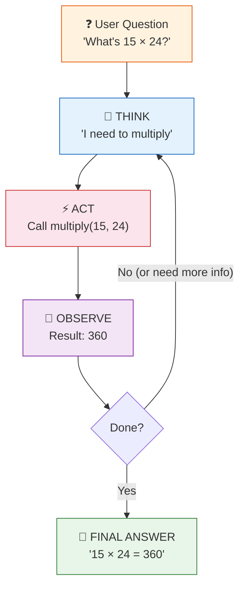

# 12 — Agents

## What are agents?

Agents give an LLM **tools** (functions it can call) and let it decide *how* to accomplish a task. Instead of following a fixed chain, the LLM plans, calls tools, observes results, and iterates.

## The agent loop (ReAct)

## What you'll learn

- `create_react_agent` — ReAct (Reason + Act) agent
- `Tool` — wrap any Python function as a tool
- Agent executor — runs the agent loop (think → act → observe → repeat)
- Built-in tools — Wikipedia, calculator, search

## Key idea

Agents = LLM + Tools + Loop. The LLM decides which tool to call and when the task is done.
