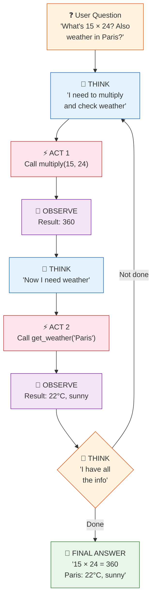
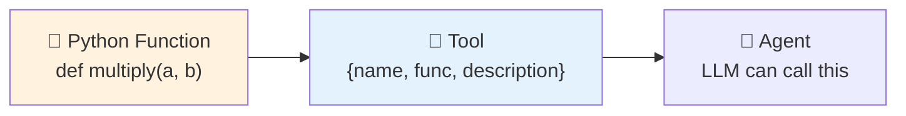

# 12 — Agents

## What are Agents?

Agents give an LLM **tools** (functions it can call) and let it decide **how** to accomplish a task. Instead of following a fixed chain, the LLM:

1. **Thinks** — what should I do?
2. **Acts** — calls a tool
3. **Observes** — sees the tool's result
4. **Repeats** — until the task is done

This is called the **ReAct** loop (Reason + Act).

## The Agent Loop (ReAct)



## What You'll Learn

| Component | What It Does |
|-----------|-------------|
| `Tool` | Wraps a Python function so the LLM can call it |
| `create_react_agent` | Creates the ReAct agent (LLM + tools + prompt) |
| `AgentExecutor` | Runs the think→act→observe loop |
| `WikipediaQueryRun` | Built-in tool for Wikipedia lookup |

## Code Walkthrough

### 1. Creating Tools

```python
def multiply(a: float, b: float) -> float:
    """Multiply two numbers together."""
    return a * b

tools = [
    Tool(name="Multiply", func=multiply, description="Multiply two numbers."),
    Tool(name="Weather", func=get_weather, description="Get weather for a city."),
]
```

**What it does:** Wraps Python functions as tools the LLM can use. The **description** is critical — the LLM reads it to decide which tool to call.



### 2. Creating the Agent

```python
prompt = PromptTemplate.from_template("""
Answer using this format:
Thought: what to do
Action: tool name
Action Input: tool input
Observation: tool result
... (repeat)
Thought: I now know the answer
Final Answer: ...
""")

agent = create_react_agent(llm, tools, prompt)
agent_executor = AgentExecutor(agent=agent, tools=tools, verbose=True)
```

**What it does:** The prompt defines the **ReAct format** — the LLM must output `Thought/Action/Action Input/Observation` in a loop until it reaches `Final Answer`.

### 3. Running the Agent

```python
response = agent_executor.invoke({"input": "What is 15 × 24? Also, what's the weather in Paris?"})
```

**What happens inside:**

```
Thought: I need to multiply 15 × 24 and check weather. Let me start.
Action: Multiply
Action Input: 15, 24
Observation: 360
Thought: Now I need the weather in Paris.
Action: Weather
Action Input: Paris
Observation: 22°C, sunny
Thought: I have all the information.
Final Answer: 15 × 24 = 360. Paris: 22°C, sunny.
```

## Key Concept: Agents vs Chains

| Chains | Agents |
|--------|--------|
| Fixed, predefined steps | LLM decides the steps |
| Always runs the same way | Dynamic — adapts to the question |
| Predictable | Flexible |
| Good for known workflows | Good for open-ended tasks |

**Agents = LLM + Tools + Loop.** The LLM chooses which tool to call and when the task is complete.

## Summary

- **Tools** are Python functions with a name + description
- The **ReAct loop** is: Think → Act → Observe → Repeat
- The **AgentExecutor** runs the loop automatically
- Agents are flexible but slower — use chains when the workflow is fixed
- Built-in tools: Wikipedia, calculator, search (and you can make your own)
