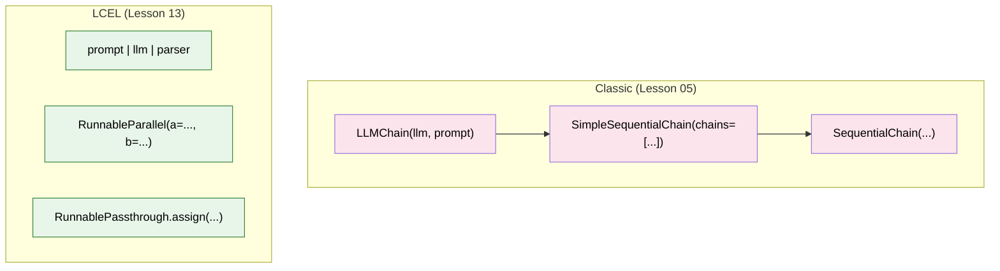
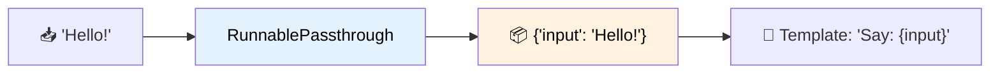
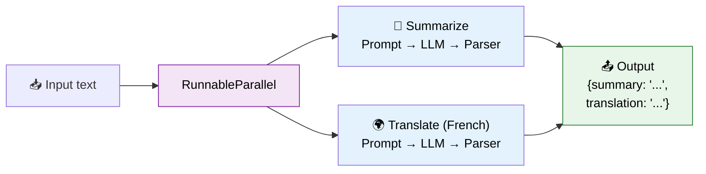
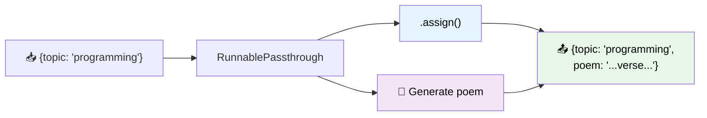

# 13 — LCEL (LangChain Expression Language)

## What is LCEL?

LCEL is the **modern way** to build chains using the `|` (pipe) operator. It's:

- **Declarative** — say *what* to do, not *how*
- **Composable** — any runnable can be combined with `|`
- **Auto-capable** — everything you `|` together gets streaming, async, and batch for free

## Visual: LCEL vs Classic Chains



## What You'll Learn

| Component | What It Does | Visual |
|-----------|-------------|--------|
| `RunnablePassthrough` | Passes data through unchanged | `input → output` |
| `RunnableParallel` | Runs multiple chains simultaneously | Fork |
| `RunnableBranch` | Routes to different chains based on condition | Switch |
| `.assign()` | Adds computed fields to a dict | Enrich |

## Code Walkthrough

### 1. RunnablePassthrough — Pass Through

```python
chain = {"input": RunnablePassthrough()} | ChatPromptTemplate.from_template("Say: {input}") | llm | StrOutputParser()
```

**What it does:** `RunnablePassthrough()` takes whatever input it receives and passes it through unchanged. Here, it puts the raw input into a dict under the key `"input"` so the template can use `{input}`.



### 2. RunnableParallel — Run in Parallel

```python
parallel_chain = RunnableParallel(
    summary=summary_prompt | llm | StrOutputParser(),
    translation=translation_prompt | llm | StrOutputParser(),
)
response = parallel_chain.invoke({"text": "LangChain makes it easy to build LLM apps."})
```

**What it does:** Takes the same input and runs 2 independent chains on it simultaneously. Returns a dict with both results.



### 3. `.assign()` — Add Computed Fields

```python
chain = RunnablePassthrough.assign(
    poem=lambda x: ChatPromptTemplate.from_template("Write a poem about {topic}") | llm | StrOutputParser()
)
response = chain.invoke({"topic": "programming"})
# response = {"topic": "programming", "poem": "...poem text..."}
```

**What it does:** Starts with the input dict `{"topic": "programming"}`, passes it through (preserving `topic`), and adds a new key `"poem"` computed by running an LLM chain.



## Key Concept: Everything is a Runnable

In LCEL, every component is a **`Runnable`**:
- Prompts → `Runnable`
- Models → `Runnable`
- Parsers → `Runnable`
- Custom functions → `RunnableLambda`
- Dicts → `RunnableParallel` (automatically)

```python
# These are ALL runnables:
prompt | llm | parser                    # chain
{"key": RunnablePassthrough()}           # dict with passthrough
RunnableParallel(a=chain1, b=chain2)     # parallel
```

**Why it matters:** If it's a Runnable, you can `.invoke()`, `.stream()`, `.batch()`, and `.ainvoke()` it — no extra code needed.

## Summary

| Pattern | Purpose | Example |
|---------|---------|---------|
| `A \| B \| C` | Sequential pipeline | `prompt \| llm \| parser` |
| `RunnableParallel(a=..., b=...)` | Run chains in parallel | `summary + translation` |
| `.assign(key=...)` | Add computed fields | `input + generated poem` |
| `RunnablePassthrough()` | Pass data through | Forward input to next step |

LCEL is the **recommended way** to build chains in modern LangChain (≥0.3).
