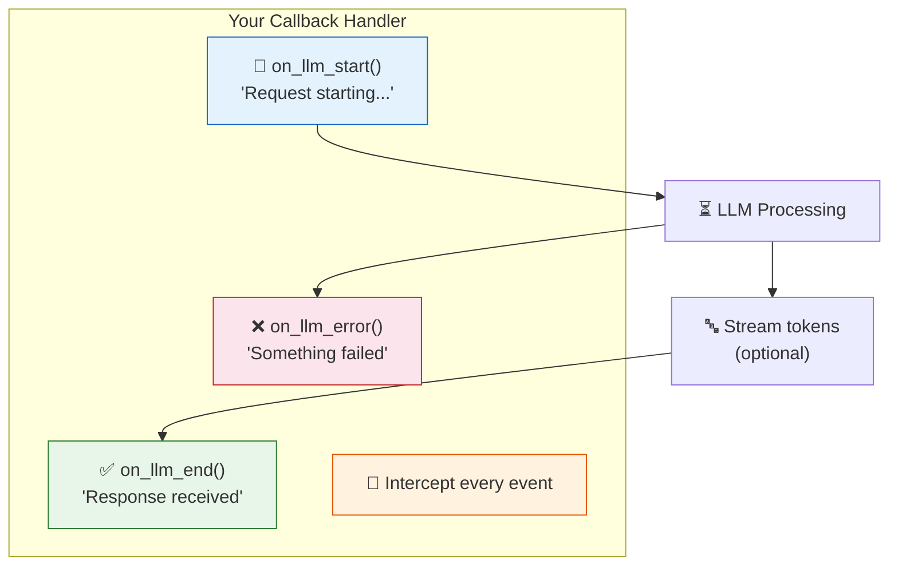
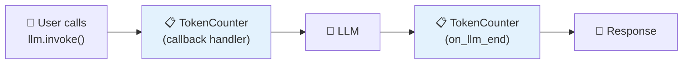
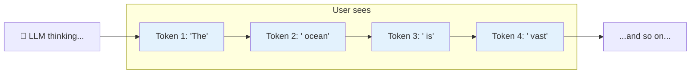

# 14 — Callbacks & Streaming

## Why Callbacks?

Callbacks let you **hook into the LLM lifecycle** — when a request starts, when a token arrives, when an error occurs. Use them for:

- **Logging** — track every LLM call
- **Monitoring** — measure latency, token count
- **Token counting** — track usage for billing
- **UI updates** — show streaming tokens in real-time

## Visual: The LLM Lifecycle



## What You'll Learn

| Concept | What It Does |
|---------|-------------|
| `BaseCallbackHandler` | Base class for custom handlers — override methods you need |
| `on_llm_start` | Fired when an LLM call begins |
| `on_llm_end` | Fired when the response is complete |
| `on_llm_error` | Fired when an error occurs |
| Streaming | Real-time token-by-token output |

## Code Walkthrough

### 1. Custom Callback Handler

```python
class TokenCounter(BaseCallbackHandler):
    def __init__(self):
        self.token_count = 0

    def on_llm_start(self, serialized, prompts, **kwargs):
        print(f"[LLM Start] Prompt length: {len(prompts[0])} chars")

    def on_llm_end(self, response, **kwargs):
        tokens = sum(len(generation.message.content.split()) for generation in response.generations[0])
        self.token_count += tokens
        print(f"[LLM End] Generated ~{tokens} words")

    def on_llm_error(self, error, **kwargs):
        print(f"[LLM Error] {error}")

handler = TokenCounter()
llm = ChatOpenAI(model="deepseek-chat", base_url="https://api.deepseek.com", callbacks=[handler])
```

**What it does:** Creates a custom handler that:
1. Prints "[LLM Start]" with prompt length when a call begins
2. Counts tokens and prints "[LLM End]" when the response arrives
3. Prints "[LLM Error]" if something fails

The handler is attached to the LLM via the `callbacks` parameter.



### 2. Streaming Tokens

```python
llm = ChatOpenAI(model="deepseek-chat", base_url="https://api.deepseek.com", streaming=True)
chain = prompt | llm | StrOutputParser()

for chunk in chain.stream({"topic": "the ocean"}):
    print(chunk, end="", flush=True)
```

**What it does:** Sets `streaming=True` on the LLM. Instead of waiting for the full response, tokens arrive one by one. `chain.stream()` yields each chunk as it arrives.



**Without streaming (blocking):** Wait 10 seconds → see full response at once
**With streaming (non-blocking):** See words appear in real-time

## Key Concept: Callbacks Don't Change Behavior

Callbacks are **observers** — they listen but don't modify the chain. You can add or remove them without changing how your chain works. This is the **Observer pattern** in software engineering.

## Summary

- **Callbacks** = hooks into the LLM lifecycle (start, end, error, token)
- Use `BaseCallbackHandler` to create custom observers
- Callbacks are great for logging, monitoring, and token counting
- **Streaming** sends tokens one by one for real-time display
- Any LCEL chain supports streaming automatically via `.stream()`
