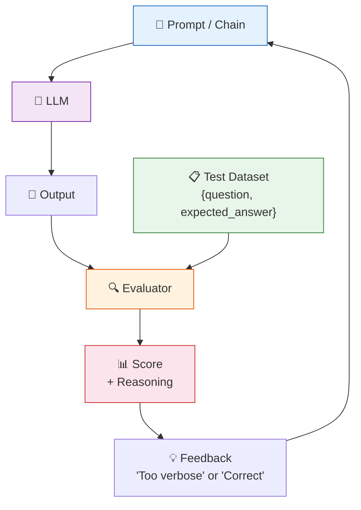
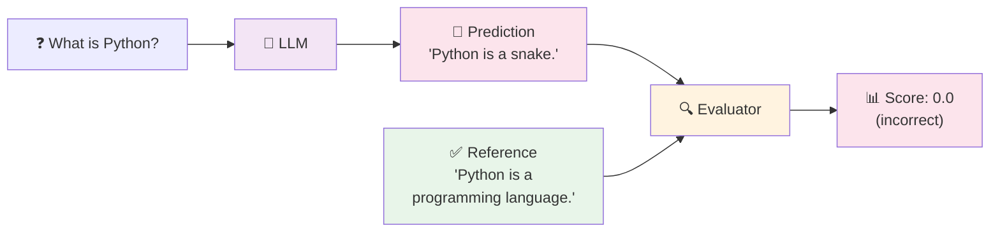

# 15 — Evaluation

## Why Evaluate?

LLM outputs are **non-deterministic** — the same prompt can give different results. You need systematic evaluation to:

- Detect **regressions** when you change prompts or models
- Measure **quality** (conciseness, correctness, harmlessness)
- **Tune** prompts and parameters
- **Compare** different models or strategies

## Visual: The Evaluation Loop



## What You'll Learn

| Evaluator | What It Does | When to Use |
|-----------|-------------|-------------|
| `CriteriaEvalChain` | Scores output against a single criterion | "Is this concise?" | 
| `LabeledCriteriaEvalChain` | Scores against a reference answer | "Is this as correct as the expected answer?" |
| Custom test loop | Run many test cases, collect scores | Regression testing |

## Code Walkthrough

### 1. Criteria Evaluation

```python
evaluator = load_evaluator("criteria", llm=llm, criteria="conciseness")

response = llm.invoke("What is Python?")
result = evaluator.evaluate_strings(
    prediction=response.content,
    input="What is Python?",
)
print(f"Score: {result.get('score')}")
```

**What it does:** Uses the LLM itself as a judge. It feeds the criterion ("conciseness"), the question, and the answer to the LLM and asks: "On a scale of 1-5, how concise is this answer?"

| Score | Meaning |
|-------|---------|
| 1 | Very verbose |
| 5 | Extremely concise |

### 2. Labeled Criteria (with Reference Answer)

```python
evaluator = load_evaluator("labeled_criteria", llm=llm, criteria="correctness")

result = evaluator.evaluate_strings(
    prediction="Python is a snake.",
    reference="Python is a programming language.",
    input="What is Python?",
)
```

**What it does:** Same as above, but also provides a **reference answer**. The evaluator compares the prediction to the reference and scores how well it matches.



### 3. Test Loop — Run Multiple Cases

```python
test_cases = [
    {"question": "What is 2+2?", "expected": "4"},
    {"question": "What is the capital of France?", "expected": "Paris"},
]

for case in test_cases:
    response = llm.invoke(case["question"])
    result = evaluator.evaluate_strings(
        prediction=response.content,
        reference=case["expected"],
        input=case["question"],
    )
    print(f"Score: {result.get('score')}")
```

**What it does:** Automates evaluation across a test dataset. Run this after every change to catch regressions.

## Key Concept: LLM-as-a-Judge

Using an LLM to evaluate another LLM is called **LLM-as-a-judge**. It's surprisingly effective but has biases:
- Prefers longer answers
- May be fooled by confident-sounding wrong answers
- Is itself non-deterministic

**Best practice:** Use multiple criteria, multiple judges, and human spot-checks.

## Summary

| Approach | What You Get |
|----------|-------------|
| Criteria eval | Score + reasoning on a single quality |
| Labeled eval | Score vs a gold-standard answer |
| Test loop | Regression detection across a dataset |

Start simple: pick 1-2 criteria (correctness, conciseness) and a small test set. Iterate from there.
