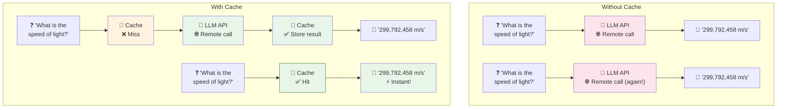
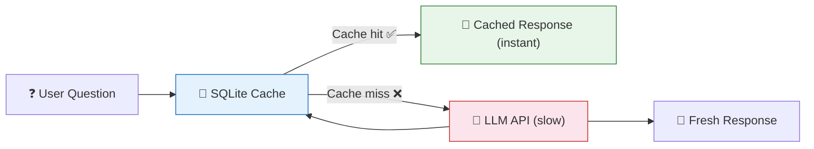

# 16 — Caching & Rate Limits

## Why Cache?

LLM calls are **slow** (1-10 seconds) and **expensive** (pay per token). Caching stores responses so identical requests return instantly without calling the API again.

## Visual: With vs Without Cache



## What You'll Learn

| Cache Type | Storage | Persistence | Best For |
|-----------|---------|-------------|----------|
| `InMemoryCache` | Python dict | Lost on restart | Development, short-lived apps |
| `SQLiteCache` | SQLite file | Survives restarts | Single-server production |
| Redis cache (custom) | Redis server | Shared across instances | Multi-server production |

## Code Walkthrough

### 1. InMemoryCache

```python
from langchain_core.caches import InMemoryCache
from langchain_classic.globals import set_llm_cache

set_llm_cache(InMemoryCache())

start = time.perf_counter()
r1 = llm.invoke("What is the speed of light?")    # 1st call: ~3 seconds
print(f"First call: {time.perf_counter() - start:.2f}s")

start = time.perf_counter()
r2 = llm.invoke("What is the speed of light?")    # 2nd call: ~0.01 seconds!
print(f"Cached call: {time.perf_counter() - start:.2f}s")
```

**What it does:** Stores responses in a Python dictionary. The first call hits the API. The second call finds the result in the cache and returns instantly.

### 2. SQLiteCache (Persistent)

```python
from langchain_community.cache import SQLiteCache

set_llm_cache(SQLiteCache(database_path=".langchain_cache.db"))
```

**What it does:** Stores responses in a SQLite database file. The cache survives restarts. Even if you stop and restart your app, cached responses are still there.



## How Cache Keys Work

The cache key is based on:
- The **model name** (e.g., `deepseek-chat`)
- The **prompt text** (exact string)
- The **parameters** (temperature, max_tokens, etc.)

Even a tiny change in prompt → different key → cache miss.

## When to Cache vs Not Cache

| Cache | Don't Cache |
|-------|-------------|
| Factual questions ("What is the capital of France?") | Creative writing (poems, stories) |
| Common queries in a chatbot | Personalized responses |
| Expensive/rate-limited APIs | Time-sensitive data (stock prices) |
| Repetitive system prompts | Random/varied outputs |

## Summary

- **InMemoryCache** → simple, fast, lost on restart
- **SQLiteCache** → persistent across restarts
- **Cache key** = model + prompt + params (exact match)
- Caching saves **time** and **money**
- Don't cache creative or time-sensitive responses
- For production multi-instance: use Redis or similar shared cache
