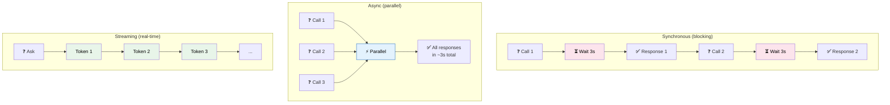
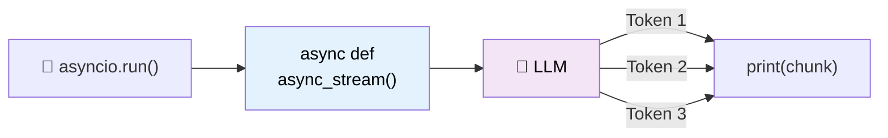
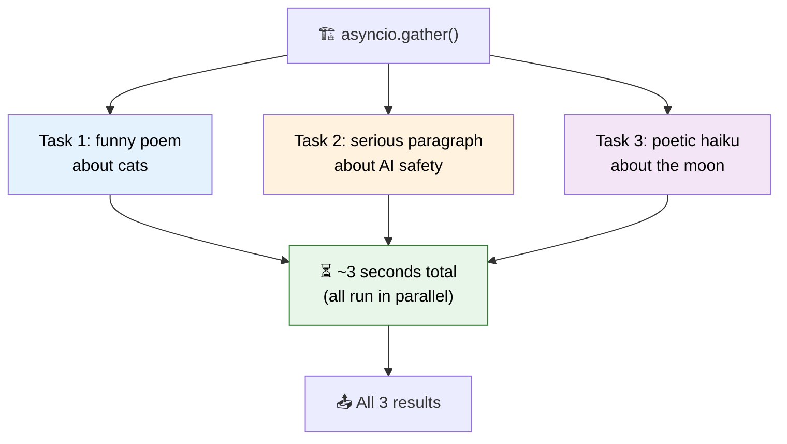

# 17 — Streaming & Async

## Why Streaming & Async?

**Streaming:** Websites and APIs need to show responses as they're generated — not wait 10 seconds for the full output. Streaming sends tokens one by one.

**Async:** When you need to make multiple LLM calls, async lets you run them **in parallel** instead of one after another.

## Visual: Sync vs Async vs Streaming



## What You'll Learn

| Method | What It Does | When to Use |
|--------|-------------|-------------|
| `.stream()` | Sync iteration over tokens | CLI apps, simple scripts |
| `.astream()` | Async iteration over tokens | Web servers (FastAPI) |
| `.ainvoke()` | Async single call | Non-blocking operations |
| `asyncio.gather()` | Run multiple async calls in parallel | Batch processing |

## Code Walkthrough

### 1. Synchronous Streaming — `.stream()`

```python
chain = prompt | llm | StrOutputParser()

for chunk in chain.stream({"topic": "octopuses"}):
    print(chunk, end="", flush=True)
```

**What it does:** Tokens arrive one by one as the LLM generates them. `flush=True` ensures each token is printed immediately (no buffering).

### 2. Async Streaming — `.astream()`

```python
async def async_stream():
    async for chunk in chain.astream({"topic": "black holes"}):
        print(chunk, end="", flush=True)

asyncio.run(async_stream())
```

**What it does:** Same as streaming, but async. The `async for` loop yields tokens without blocking the event loop — your server can handle other requests while streaming.



### 3. Parallel Async Calls — `asyncio.gather()`

```python
async def parallel_calls():
    inputs = [
        {"tone": "funny", "length": "poem", "topic": "cats"},
        {"tone": "serious", "length": "paragraph", "topic": "AI safety"},
        {"tone": "poetic", "length": "haiku", "topic": "the moon"},
    ]
    tasks = [chain.ainvoke(inp) for inp in inputs]
    results = await asyncio.gather(*tasks)
```

**What it does:** Creates 3 async tasks and runs them **simultaneously**. `asyncio.gather` waits for all to complete. Total time ≈ time of the slowest single call (not the sum).



## Key Concept: Streaming is Built Into LCEL

Any chain built with `|` supports streaming automatically:

```python
prompt | llm | StrOutputParser()   # ← This streams by default!
```

You don't need special code. Just call `.stream()` or `.astream()`. LangChain handles the plumbing.

## Summary

| You want... | Use... |
|-------------|--------|
| Real-time output in CLI | `chain.stream()` |
| Real-time output in a web server | `chain.astream()` |
| One async call (non-blocking) | `chain.ainvoke()` |
| Many parallel calls | `asyncio.gather(*tasks)` |

- **Streaming** = token-by-token output (real-time UX)
- **Async** = non-blocking operations (handle many requests)
- **Parallel** = multiple LLM calls at once (faster batch processing)
- All LCEL chains support streaming + async by default
