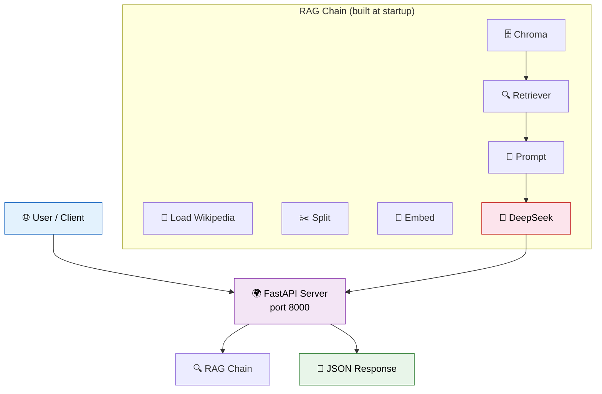
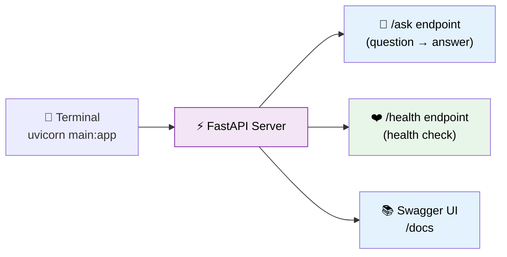

# 18 — Deployment

## Why Deployment?

A LangChain app running in your terminal isn't useful to anyone else. Deployment wraps your chain in a **web server** so users (and other services) can interact with it via HTTP.

## Visual: Architecture Overview



## What You'll Learn

| Concept | What It Does |
|---------|-------------|
| **FastAPI** | Python web framework for building APIs |
| `@app.post("/ask")` | HTTP endpoint that accepts POST requests |
| **Pydantic models** | Define request/response schemas (`Query`, `Answer`) |
| **Dockerfile** | Containerize the app for deployment |
| `/health` endpoint | Simple health check for monitoring |

## Code Walkthrough

### The RAG Chain (Built at Startup)

```python
loader = WebBaseLoader("https://en.wikipedia.org/wiki/LangChain")
docs = loader.load()
splitter = RecursiveCharacterTextSplitter(chunk_size=500, chunk_overlap=50)
chunks = splitter.split_documents(docs)
embeddings = FakeEmbeddings(size=384)
vectorstore = Chroma.from_documents(chunks, embeddings)
retriever = vectorstore.as_retriever(search_kwargs={"k": 3})
```

This runs **once** when the server starts. The vector store is built in memory.

### FastAPI Endpoints

```python
app = FastAPI(title="LangChain RAG Bot")

class Query(BaseModel):
    question: str

class Answer(BaseModel):
    answer: str

@app.post("/ask", response_model=Answer)
def ask(query: Query):
    answer = rag_chain.invoke(query.question)
    return Answer(answer=answer)

@app.get("/health")
def health():
    return {"status": "ok"}
```

**What each endpoint does:**

| Endpoint | Method | Input | Output | Purpose |
|----------|--------|-------|--------|---------|
| `/ask` | POST | `{"question": "..."}` | `{"answer": "..."}` | Ask a question, get an answer |
| `/health` | GET | Nothing | `{"status": "ok"}` | Health check for monitoring |

### Running the Server

```bash
uvicorn 18_deployment.main:app --reload
# Visit http://localhost:8000/docs for Swagger UI
```



### Docker Deployment

```dockerfile
# Dockerfile
FROM python:3.12-slim
WORKDIR /app
COPY requirements.txt .
RUN pip install -r requirements.txt
COPY . .
CMD ["uvicorn", "18_deployment.main:app", "--host", "0.0.0.0", "--port", "8000"]
```

**What it does:** Packages the app into a container. Run with:
```bash
docker build -t langchain-rag .
docker run -p 8000:8000 langchain-rag
```

## Making a Request

```bash
# Using curl
curl -X POST http://localhost:8000/ask \
  -H "Content-Type: application/json" \
  -d '{"question": "What is LangChain used for?"}'

# Response: {"answer": "LangChain is used for building LLM applications..."}
```

## Key Concept: Production Readiness

This demo is a **starting point**. For production, add:

| Feature | Why |
|---------|-----|
| **Authentication** (API keys) | Prevent unauthorized access |
| **Rate limiting** | Protect against abuse |
| **LangSmith tracing** | Monitor and debug calls |
| **Redis caching** | Share cache across instances |
| **Async streaming** | Real-time UX (see Lesson 17) |
| **Horizontal scaling** | Behind a load balancer |

## Summary

- **FastAPI** wraps your LangChain chain as an HTTP API
- The chain is built **once at startup** (not per-request)
- The `/ask` endpoint accepts a question → returns an answer
- Use **Docker** for reproducible deployment
- Visit `/docs` for the interactive Swagger UI
- Add auth, rate limiting, and monitoring for production
