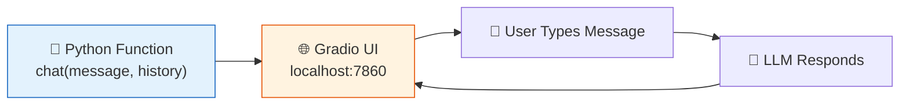

# 19 — Gradio Web UI

## What is Gradio?

[Gradio](https://gradio.app) turns any Python function into a web UI in one line of code. It's the fastest way to build an interactive interface for your LangChain app.



## What you'll learn

- `gr.ChatInterface` — instant chatbot UI from any Python function
- `gr.Blocks` — custom layouts for RAG apps, agents, and more
- Streaming responses token-by-token
- Combining Gradio with RAG pipelines

## The code

`main.py` builds 3 apps:

1. **Simple chat** — 5 lines for a full chatbot UI
2. **Streaming chat** — tokens appear as they're generated
3. **RAG Q&A** — ask questions about a Wikipedia page

## Run it

```bash
python 19_gradio/main.py
```

Then open `http://localhost:7860` in your browser.
