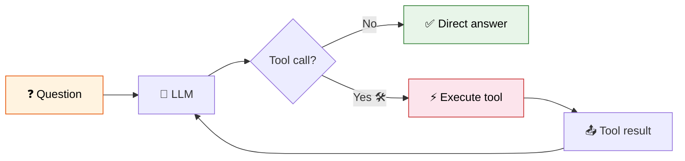

# 20 — Tool Calling

## What is Tool Calling?

Tool calling (also called **function calling**) lets an LLM decide to call external functions. The model doesn't execute the tool — it **requests** a call, and you run it and return the result.

## What you'll learn

| Tool | What it does |
|------|-------------|
| `@tool` decorator | Turn any Python function into a tool |
| `StructuredTool` | Create tools with Pydantic validation |
| `bind_tools()` | Attach tools to a chat model |
| Tool calling loop | Let LLM decide when to call tools |

## Code Walkthrough

### `@tool` decorator
```python
@tool
def multiply(a: float, b: float) -> float:
    """Multiply two numbers."""
    return a * b
```
**What it does:** `@tool` reads the function name (`multiply`), docstring (`Multiply two numbers`), and type hints (`float`, `float` → `float`). It generates a JSON schema automatically. The LLM sees this schema and can request `multiply(a=3, b=4)`. The function is now a LangChain tool — call it with `multiply.invoke({"a": 3, "b": 4})`.

### `StructuredTool.from_function()`
```python
search_tool = StructuredTool.from_function(
    func=search_web, name="web_search",
    description="Search the web", args_schema=SearchInput,
)
```
**What it does:** Creates a tool with an **explicit Pydantic schema** (`SearchInput`). The schema controls exactly what arguments the LLM can pass. Use this when you need validation beyond what `@tool` infers.

### `bind_tools()`
```python
llm_with_tools = llm.bind_tools(tools)
```
**What it does:** Attaches tool schemas to the LLM. When you invoke `llm_with_tools`, the LLM knows which tools exist. Instead of always replying with text, it can respond with `tool_calls` — a list of requested function invocations.

### Tool calling loop
```python
response = llm_with_tools.invoke(messages)
for tc in response.tool_calls:
    tool = tool_map[tc["name"]]
    result = tool.invoke(tc["args"])
    messages.append(ToolMessage(content=str(result), tool_call_id=tc["id"]))
```
**What it does:** ① LLM decides to call tools → returns `tool_calls`. ② You look up each tool by name and run it with the args. ③ You wrap the result in a `ToolMessage` (matching the `tool_call_id`) and send it back. ④ LLM reads the tool results and produces the final answer.

## Visual


