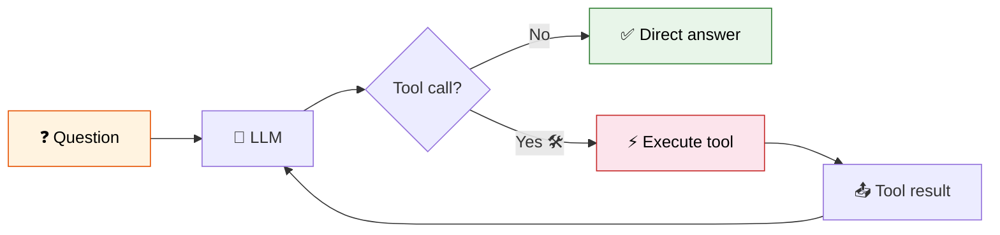

# 20 — Tool Calling

## What is Tool Calling?

Tool calling (also called **function calling**) lets an LLM decide to call external functions. The model doesn't execute the tool — it **requests** a call, and you run it and return the result.

## What you'll learn

| Tool | What it does |
|------|-------------|
| `@tool` decorator | Turn any Python function into a tool |
| `StructuredTool` | Create tools with Pydantic validation |
| `bind_tools()` | Attach tools to a chat model |
| Tool calling loop | Let LLM decide when to call tools |

## Visual

