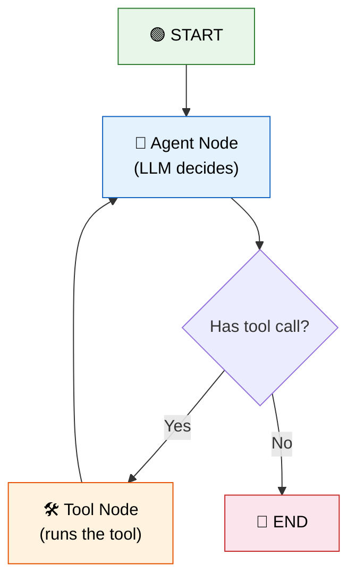

# 21 — LangGraph

## What is LangGraph?

LangGraph is the **modern** way to build agents and multi-step workflows. Instead of a linear chain, you define a **state graph** — nodes (processing steps) and edges (transitions). The agent loops through nodes until it decides to stop.

## Visual

