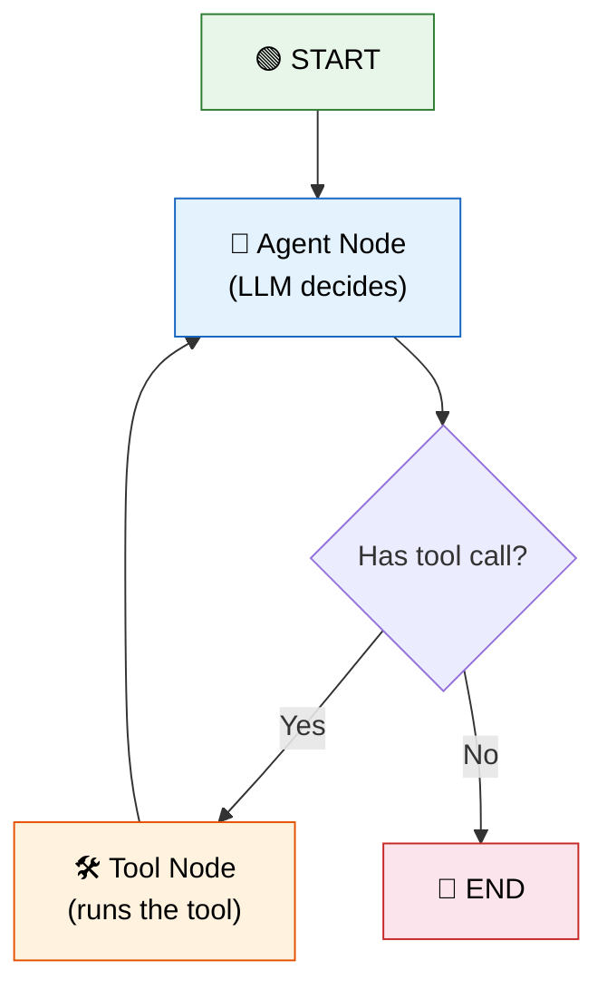

# 21 — LangGraph

## What is LangGraph?

LangGraph is the **modern** way to build agents and multi-step workflows. Instead of a linear chain, you define a **state graph** — nodes (processing steps) and edges (transitions). The agent loops through nodes until it decides to stop.

## Code Walkthrough

### `create_react_agent` (prebuilt)
```python
agent = create_react_agent(llm, tools)
response = agent.invoke({"messages": [HumanMessage("What's 5 * 3?")]})
```
**What it does:** Creates a complete ReAct agent graph with one function call. The graph has an `agent` node (LLM decides) and a `tools` node (executes tool calls). It loops automatically: agent → tools → agent → tools → ... until no more tool calls. This is the **simplest way** to build an agent.

### Custom `StateGraph` (full control)
```python
class AgentState(TypedDict):
    messages: Annotated[Sequence, operator.add]
    next: str

graph = StateGraph(AgentState)
graph.add_node("agent", call_model)
graph.add_node("tools", tool_node)
graph.set_entry_point("agent")
graph.add_conditional_edges("agent", should_continue, {"tools": "tools", "end": END})
graph.add_edge("tools", "agent")
app = graph.compile()
```
**What each part does:**
- `AgentState` — The state schema. Every node reads from it and writes updates to it.
- `add_node("agent", call_model)` — Registers `call_model` as a node named `"agent"`. The function receives the current state and returns state updates.
- `set_entry_point("agent")` — Start execution at the `"agent"` node.
- `add_conditional_edges("agent", should_continue, ...)` — After `"agent"` runs, call `should_continue(state)`. It returns `"tools"` or `"end"`. The `path_map` dict maps return values to actual node names.
- `add_edge("tools", "agent")` — After `"tools"` finishes, always go back to `"agent"` (the ReAct loop).
- `compile()` — Freezes the graph into an executable. The returned `app` is a runnable with `.invoke()`, `.stream()`, etc.

### `ToolNode`
```python
tool_node = ToolNode(tools)
```
**What it does:** A pre-built node that takes the last `AIMessage`'s `tool_calls`, executes each tool with its args, and returns `ToolMessage` results. All tool calls run in parallel.

## Visual


