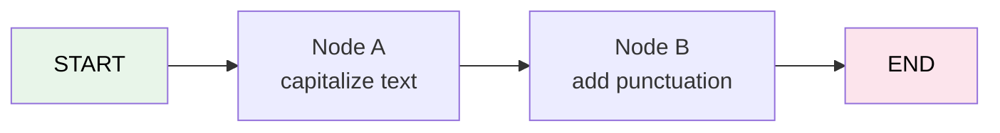

# 23 — StateGraph Basics

## What is StateGraph?

`StateGraph` is the core building block of LangGraph. You define **nodes** (processing steps) and **edges** (connections). Then you **compile** it into an executable graph.

## What you'll learn

- `StateGraph(TypedDict)` — define state schema
- `add_node(name, fn)` — add a processing step
- `add_edge(from, to)` — connect steps
- `set_entry_point(key)` — where to start
- `.compile()` — make it executable
- `.invoke()` — run the graph

## Key idea

State flows through the graph. Each node **receives** the current state and **returns** updates to it.
