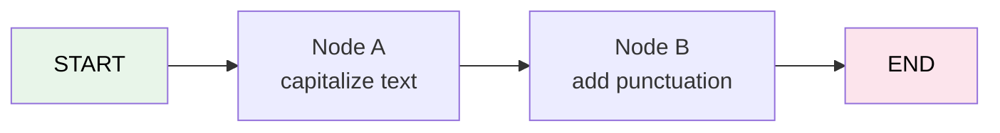

# 23 — StateGraph Basics

## What is StateGraph?

`StateGraph` is the core building block of LangGraph. You define **nodes** (processing steps) and **edges** (connections). Then you **compile** it into an executable graph.



## What you'll learn

- `StateGraph(TypedDict)` — define state schema
- `add_node(name, fn)` — add a processing step
- `add_edge(from, to)` — connect steps
- `set_entry_point(key)` — where to start
- `.compile()` — make it executable
- `.invoke()` — run the graph

## Code Walkthrough

```python
class State(TypedDict):
    text: str
    steps: int

def node_a(state: State) -> dict:
    return {"text": state["text"].upper(), "steps": state["steps"] + 1}

builder = StateGraph(State)
builder.add_node("capitalize", node_a)
builder.add_node("exclaim", node_b)
builder.add_edge(START, "capitalize")
builder.add_edge("capitalize", "exclaim")
builder.add_edge("exclaim", END)
graph = builder.compile()
result = graph.invoke({"text": "hello", "steps": 0})
```

**What each piece does:**
- `class State(TypedDict)` — Defines the **state schema**. Every node reads from this dict and returns updates to it.
- `node_a(state)` — A **node function**. Receives the full state, returns a **partial dict** with only the fields it wants to update. Here it uppercases `text` and increments `steps`.
- `StateGraph(State)` — Creates a graph builder that knows the state shape.
- `add_node("capitalize", node_a)` — Registers `node_a` with the name `"capitalize"`.
- `add_edge(START, "capitalize")` — From the virtual start node, go to `"capitalize"`.
- `add_edge("capitalize", "exclaim")` — After `"capitalize"` finishes, go to `"exclaim"`.
- `compile()` — Freezes the builder into an executable graph.
- `invoke({...})` — Runs the graph with initial state. Returns the **final state** after all nodes run.

## Key idea

State flows through the graph. Each node **receives** the current state and **returns** updates to it.
