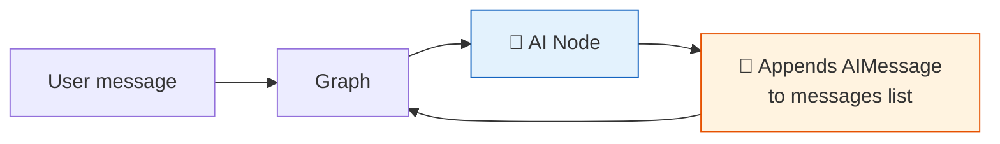

# 24 — MessagesState

## What is MessagesState?

`MessagesState` is a pre-built state schema for chatbots. It's a `TypedDict` with a single key `messages` that uses the `add_messages` reducer — new messages are **appended** to the list automatically.

## What you'll learn

- `MessagesState` — ready-made chatbot state
- `add_messages` reducer — auto-append messages
- Building a simple chat node
- Running a turn-by-turn conversation

## Key idea

The `add_messages` reducer merges by ID — no duplicate messages. Each node just returns `{"messages": [new_msg]}` and it's appended.
