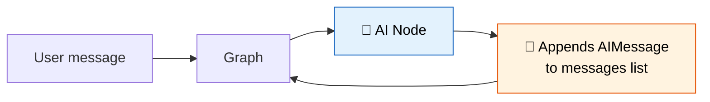

# 24 — MessagesState

## What is MessagesState?

`MessagesState` is a pre-built state schema for chatbots. It's a `TypedDict` with a single key `messages` that uses the `add_messages` reducer — new messages are **appended** to the list automatically.



## What you'll learn

- `MessagesState` — ready-made chatbot state
- `add_messages` reducer — auto-append messages
- Building a simple chat node
- Running a turn-by-turn conversation

## Code Walkthrough

```python
from langgraph.graph.message import MessagesState

def chat_node(state: MessagesState) -> dict:
    response = llm.invoke(state["messages"])
    return {"messages": [response]}

builder = StateGraph(MessagesState)
builder.add_node("chat", chat_node)
builder.add_edge(START, "chat")
builder.add_edge("chat", END)
graph = builder.compile()
result = graph.invoke({"messages": [HumanMessage("Hi, I'm Alice.")]})
```

**What each piece does:**
- `MessagesState` — A pre-built `TypedDict` with one field: `messages: Annotated[list, add_messages]`. The `add_messages` reducer appends new messages to the list automatically.
- `state["messages"]` — The current list of all messages in the conversation. Each node reads it and can append.
- `return {"messages": [response]}` — Returns a list with one new message. The `add_messages` reducer merges it into the existing state — it **appends**, it doesn't replace.
- `graph.invoke(...)` — Starts the graph with an initial message. The node sees `[HumanMessage("Hi")]`, generates a response, and returns `{"messages": [AIMessage("Hello!")]}`. The final state has both messages.

**Why two invokes show stateless behavior:** LangGraph doesn't remember history between separate `invoke()` calls unless you use a checkpointer (lesson 27).

## Key idea

The `add_messages` reducer merges by ID — no duplicate messages. Each node just returns `{"messages": [new_msg]}` and it's appended.
