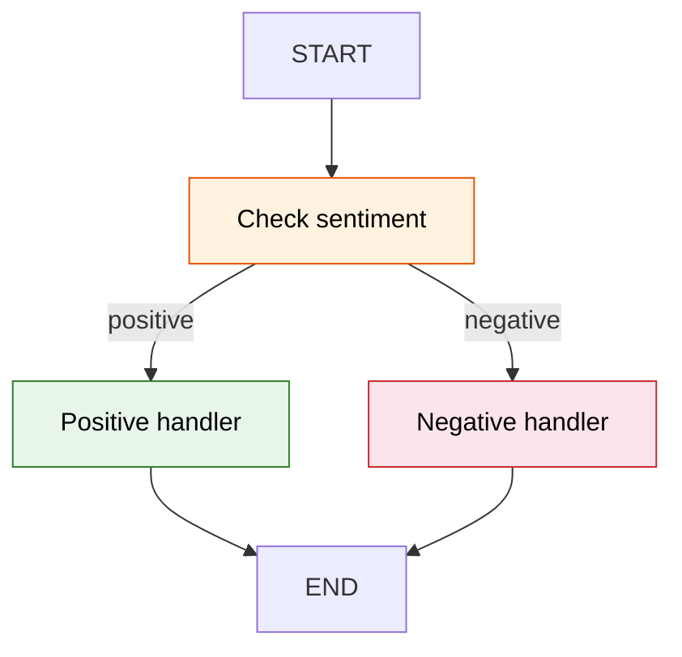

# 25 — Conditional Edges

## What are conditional edges?

A conditional edge routes to **different nodes** based on the current state. The router function looks at the state and returns the name of the next node.



## What you'll learn

- `add_conditional_edges(source, router, path_map)` — routing logic
- Router function returns a node name string
- `path_map` dict maps return values to node names

## Code Walkthrough

```python
def router(state: State) -> str:
    return state["sentiment"]

builder.add_conditional_edges("analyze", router, {"positive": "positive", "negative": "negative"})
```

**What each piece does:**
- `router(state)` — A **router function**. It receives the current state and returns a string — the name of the next node to run. Here it returns `"positive"` or `"negative"` based on the `sentiment` field set by the analyze node.
- `add_conditional_edges("analyze", router, path_map)` — After `"analyze"` finishes, call `router(state)` to decide where to go next. The `path_map` dict maps return values to node names: if router returns `"positive"`, go to the `"positive"` node.
- **No matching node** = the graph stops. If the router returns a string not in `path_map`, the graph ends.

**The flow:** User input → analyze sentiment → router checks sentiment → positive handler OR negative handler → END.

## Key idea

The router function gets the full state and returns the **name** of the next node. If the name doesn't match any node, the graph stops.
