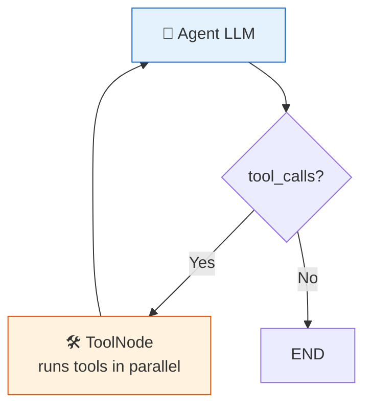

# 26 — ToolNode

## What is ToolNode?

`ToolNode` executes tool calls inside a LangGraph. It reads the last `AIMessage`'s `tool_calls`, runs each tool, and returns `ToolMessage` results.

## What you'll learn

- `ToolNode(tools)` — run tools from LLM requests
- `tools_condition()` — built-in router: "tools" if tool_calls else END
- Combining `ToolNode` + conditional edge for a ReAct loop

## Key idea

`ToolNode` is the bridge between "LLM wants to call a tool" and "the tool actually runs". It handles parallel execution automatically.
