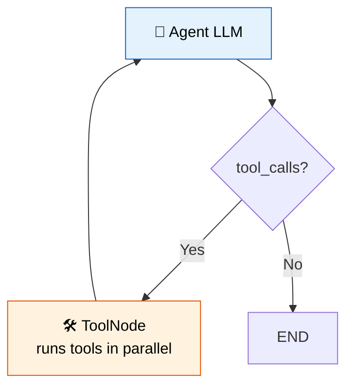

# 26 — ToolNode

## What is ToolNode?

`ToolNode` executes tool calls inside a LangGraph. It reads the last `AIMessage`'s `tool_calls`, runs each tool, and returns `ToolMessage` results.



## What you'll learn

- `ToolNode(tools)` — run tools from LLM requests
- `tools_condition()` — built-in router: "tools" if tool_calls else END
- Combining `ToolNode` + conditional edge for a ReAct loop

## Code Walkthrough

```python
from langgraph.prebuilt import ToolNode, tools_condition

def agent(state: MessagesState) -> dict:
    return {"messages": [llm_with_tools.invoke(state["messages"])]}

builder.add_node("agent", agent)
builder.add_node("tools", ToolNode(tools))
builder.add_edge(START, "agent")
builder.add_conditional_edges("agent", tools_condition)
builder.add_edge("tools", "agent")
```

**What each piece does:**
- `ToolNode(tools)` — A pre-built node that takes the last `AIMessage`, extracts any `tool_calls`, executes each tool with its arguments, and returns `ToolMessage` results. All tool calls run **in parallel**.
- `tools_condition` — A pre-built **router function**. It checks if the last message has `tool_calls`. If yes, returns `"tools"`. If no, returns `"__end__"`. You use it directly in `add_conditional_edges`.
- `llm_with_tools.invoke(state["messages"])` — The agent node passes the **full conversation history** to the LLM. The LLM sees all previous tool results when deciding what to do next.
- `add_edge("tools", "agent")` — After tools run, always go back to the agent. This creates the ReAct loop: agent → tools → agent → tools → ... until the agent stops requesting tools.

**The flow:** LLM decides → if tool call → run tools → back to LLM → loop until LLM answers directly.

## Key idea

`ToolNode` is the bridge between "LLM wants to call a tool" and "the tool actually runs". It handles parallel execution automatically.
