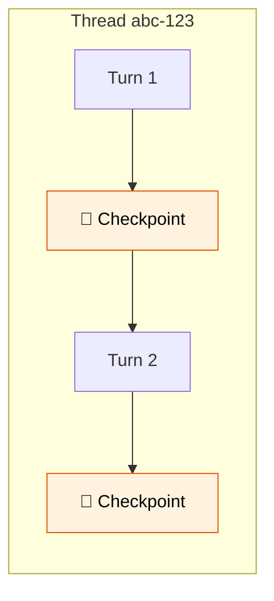

# 27 — Checkpointing

## What is checkpointing?

Checkpointing saves the graph state after **every step**. This means the graph can be paused, resumed, and replayed. Each conversation gets a **thread_id** — separate sessions stay isolated.

## What you'll learn

- `MemorySaver` — in-memory checkpointer
- `configurable={"thread_id": "..."}` — session identity
- `get_state()` — inspect current state
- `get_state_history()` — past checkpoints (time travel)

## Key idea

Without checkpointing, each `invoke()` is fresh. With it, the graph remembers everything across turns — like memory for agents.
