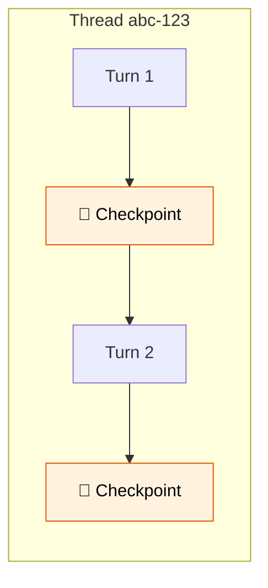

# 27 — Checkpointing

## What is checkpointing?

Checkpointing saves the graph state after **every step**. This means the graph can be paused, resumed, and replayed. Each conversation gets a **thread_id** — separate sessions stay isolated.



## What you'll learn

- `MemorySaver` — in-memory checkpointer
- `configurable={"thread_id": "..."}` — session identity
- `get_state()` — inspect current state
- `get_state_history()` — past checkpoints (time travel)

## Code Walkthrough

```python
from langgraph.checkpoint.memory import MemorySaver

checkpointer = MemorySaver()
graph = builder.compile(checkpointer=checkpointer)
config = {"configurable": {"thread_id": "alice-1"}}

result = graph.invoke({"messages": [HumanMessage("Hi, I'm Alice.")]}, config=config)
result = graph.invoke({"messages": [HumanMessage("What's my name?")]}, config=config)
```

**What each piece does:**
- `MemorySaver()` — A **checkpointer** that saves the full graph state to memory after **every step**. It's a simple Python dict — nothing to set up.
- `compile(checkpointer=checkpointer)` — Tells the graph to save state after each node completes. Without this, each `invoke()` is stateless.
- `configurable: {"thread_id": "alice-1"}` — A **session identifier**. The checkpointer uses `thread_id` to organize checkpoints. Two calls with the same `thread_id` share history. Different `thread_id` = separate conversations.
- `get_state(config)` — Fetches the current checkpoint. Returns a `StateSnapshot` with the `values` (state dict) and `next` (pending nodes). Useful for debugging or resuming.
- `get_state_history(config)` — Lists all previous checkpoints for a thread. You can **replay** the conversation from any point.

**Without checkpointer:** Turn 2 doesn't know what happened in Turn 1.
**With checkpointer:** Turn 2 sees the full history and remembers your name.

## Key idea

Without checkpointing, each `invoke()` is fresh. With it, the graph remembers everything across turns — like memory for agents.
