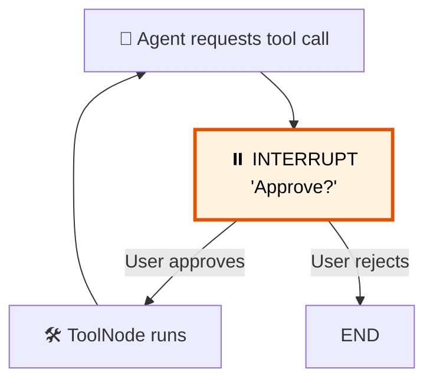

# 28 — Human-in-the-Loop

## What is Human-in-the-Loop?

Sometimes the agent shouldn't act without approval. `interrupt()` **pauses** the graph, surfaces a value, and waits for a `Command(resume=...)` to continue.

## What you'll learn

- `interrupt(value)` — pause graph execution
- `Command(resume=value)` — resume with user input
- `.invoke()` with `Command` to continue
- Approval patterns before tool execution

## Key idea

`interrupt()` raises a `GraphInterrupt` that's caught by the runtime. The graph pauses, the user decides, then `Command(resume=...)` kicks it back into action.
