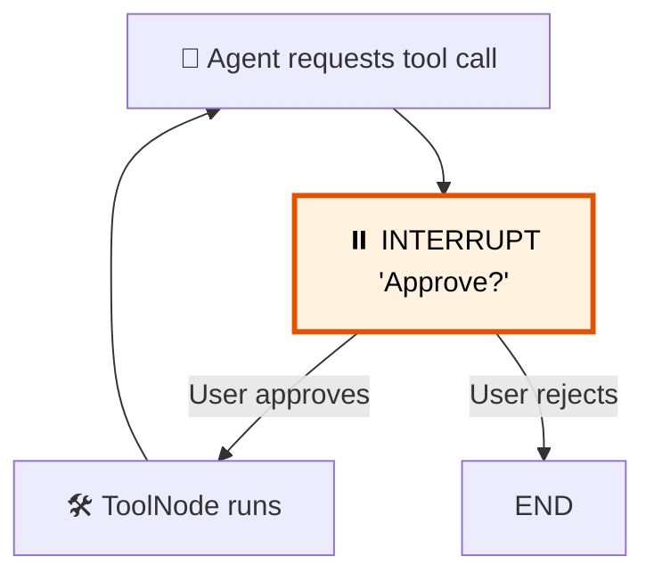

# 28 — Human-in-the-Loop

## What is Human-in-the-Loop?

Sometimes the agent shouldn't act without approval. `interrupt()` **pauses** the graph, surfaces a value, and waits for a `Command(resume=...)` to continue.



## What you'll learn

- `interrupt(value)` — pause graph execution
- `Command(resume=value)` — resume with user input
- `.invoke()` with `Command` to continue
- Approval patterns before tool execution

## Code Walkthrough

```python
from langgraph.types import Command, interrupt

def agent(state: MessagesState) -> dict:
    response = llm.invoke(state["messages"])
    if response.tool_calls:
        for tc in response.tool_calls:
            interrupt({"question": f"Approve {tc['name']}?", "tool_call": tc})
    return {"messages": [response]}
```

**What each piece does:**
- `interrupt(value)` — **Pauses** graph execution. The `value` (a dict with question + data) is surfaced to the caller. The graph stops and waits. No more nodes run until it's resumed.
- `Command(resume="approved")` — **Resumes** the graph from an interrupt. Passed to `graph.invoke(Command(...), config=config)`. The `resume` value is returned by the `interrupt()` call (though we ignore it here).
- `get_state(config).tasks` — After an interrupt, inspect pending tasks. Each task has `.interrupts` containing the interrupt values. Useful for building UIs that show approval requests.

**The flow:** Agent requests tool → interrupt fires → `invoke()` raises `GraphInterrupt` → you catch it → check `get_state()` → user approves → `invoke(Command(resume=...))` → graph continues → tool runs → agent responds.

## Key idea

`interrupt()` raises a `GraphInterrupt` that's caught by the runtime. The graph pauses, the user decides, then `Command(resume=...)` kicks it back into action.
