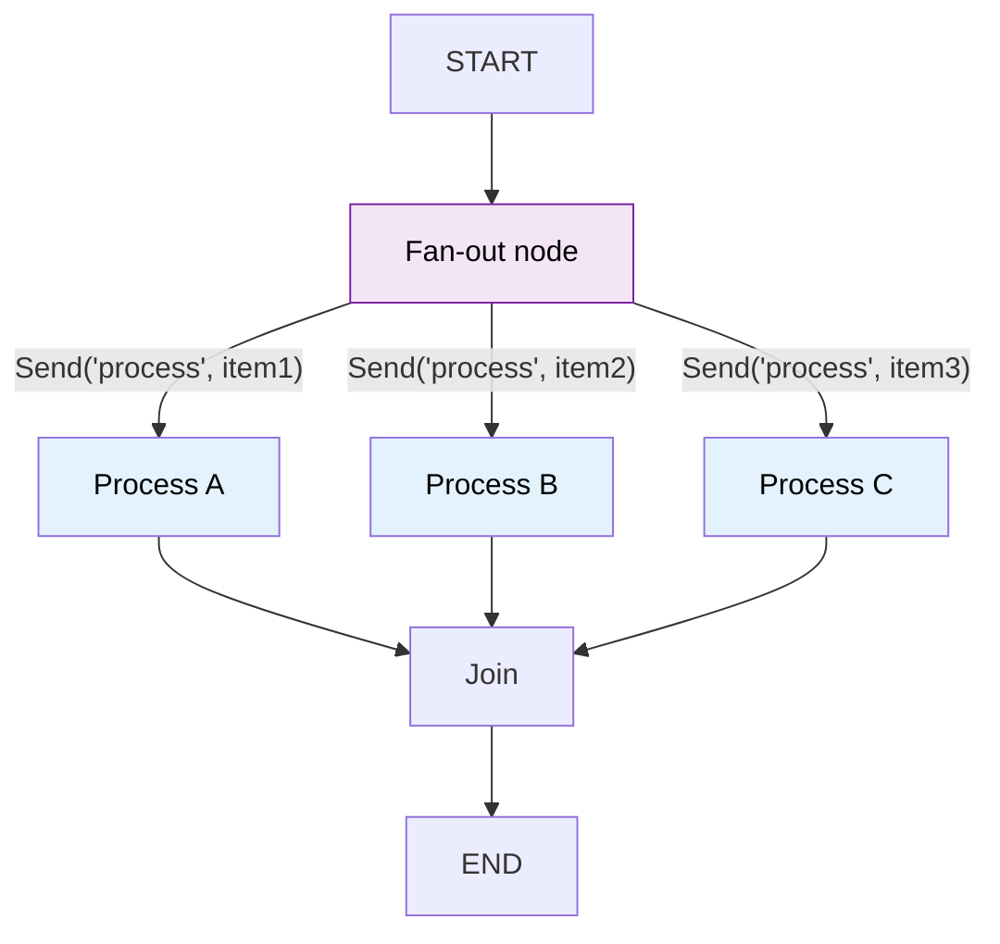

# 29 — Send API (Dynamic Parallelism)

## What is the Send API?

`Send(node, arg)` lets you **dynamically** fan out to multiple nodes in parallel. It's like `add_conditional_edges` but instead of routing to one node, it routes to **many** — each with its own argument.

## What you'll learn

- `Send(node, arg)` — send a message to a specific node
- Returning a list of `Send` from a node to fan out
- All `Send` instances execute in parallel
- Results merge back via the state reducer

## Key idea

`Send` enables map-reduce patterns. One node decides what work to do and fans out to N parallel workers. The `add_messages` reducer merges results automatically.
