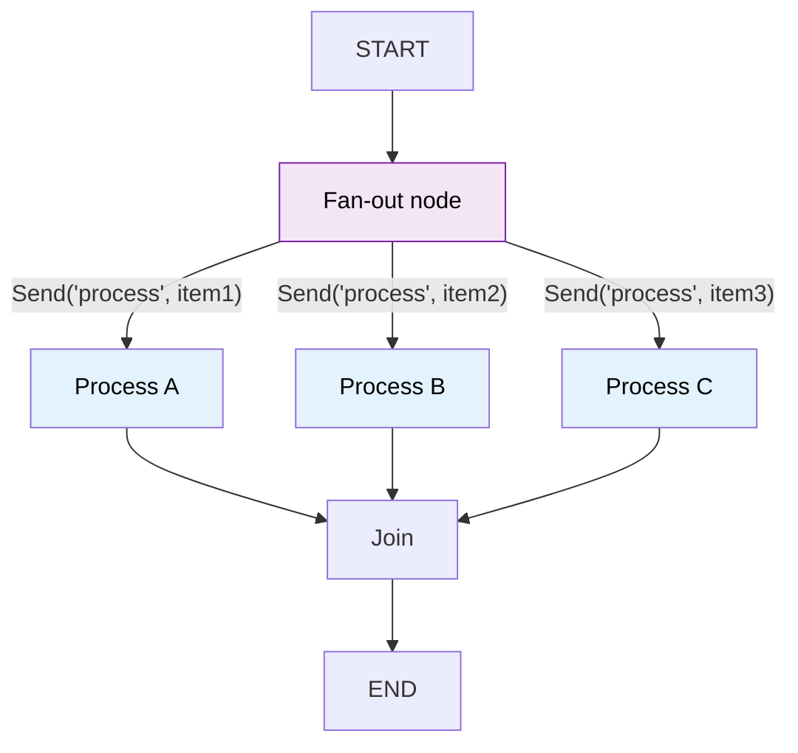

# 29 — Send API (Dynamic Parallelism)

## What is the Send API?

`Send(node, arg)` lets you **dynamically** fan out to multiple nodes in parallel. It's like `add_conditional_edges` but instead of routing to one node, it routes to **many** — each with its own argument.



## What you'll learn

- `Send(node, arg)` — send a message to a specific node
- Returning a list of `Send` from a node to fan out
- All `Send` instances execute in parallel
- Results merge back via the state reducer

## Code Walkthrough

```python
from langgraph.types import Send

def route_topics(state: State) -> list[Send]:
    return [Send("analyze", {"topic": t}) for t in state["topics"]]

builder.add_conditional_edges("fan_out", route_topics, ["analyze"])
```

**What each piece does:**
- `Send("analyze", {"topic": t})` — Sends a **message** to a node. First arg is the target node name. Second arg is the state to send — it can be **different** from the main graph state. Here each worker gets a dict with just `{"topic": "..."}`.
- `route_topics(state) -> list[Send]` — A router function that returns a **list** of `Send` objects. Each `Send` creates a **parallel invocation** of the target node. All run simultaneously.
- `add_conditional_edges("fan_out", route_topics, ["analyze"])` — The `path_map` is a list `["analyze"]` — indicating that `Send` objects target the `"analyze"` node.
- `operator.add` reducer — With `results: Annotated[list[str], operator.add]`, each worker's returned results are **merged** into one list automatically.

**The flow:** fan_out → route_topics creates 3 `Send` objects → 3 `"analyze"` nodes run in parallel → each returns one result → all results merge into one list → graph continues.

## Key idea

`Send` enables map-reduce patterns. One node decides what work to do and fans out to N parallel workers. The `add_messages` reducer merges results automatically.
