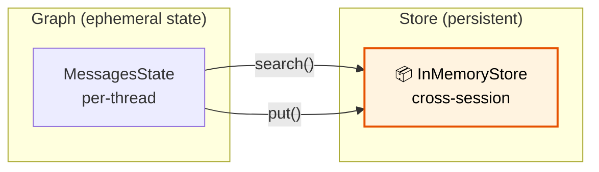

# 30 — Long-Term Memory

## What is long-term memory?

`BaseStore` provides a **persistent key-value store** that lives **outside** the graph's state. Data stored here survives across threads, sessions, and restarts.



## What you'll learn

- `InMemoryStore` — persistent key-value store
- `store.put(namespace, key, value)` — save data
- `store.search(namespace)` — query data
- Cross-session memory — remember user facts

## Code Walkthrough

```python
from langgraph.store.memory import InMemoryStore
from langgraph.config import get_store

store = InMemoryStore()  # persistent across threads
graph = builder.compile(store=store)

def chat(state: MessagesState, config) -> dict:
    my_store = get_store()
    items = my_store.search(("users", user_id))
    my_store.put(("users", user_id), thread_id, {"value": "some data"})
```

**What each piece does:**
- `InMemoryStore()` — A **persistent key-value store** that lives outside the graph state. Data put here survives across threads, sessions, and restarts (within memory).
- `compile(store=store)` — Connects the store to the graph. Inside nodes, use `get_store()` to access it.
- `store.search(("users", user_id))` — Queries items in a **namespace**. Namespaces are tuples like `("users", "alice")`. This searches all items under that path.
- `store.put(("users", user_id), key, value)` — Stores data. First arg is the namespace, second is the item key, third is the value dict. Can include `index=` for vector search.
- `get_store()` — Inside a node, call this to get the store. The store was passed to `compile()`, and `get_store()` retrieves it from the runtime context.

**State vs Store:** State is reset per `invoke()`. Store persists. Use state for conversation turns. Use store for user profiles, learned preferences, and cross-session data.

## Key idea

State is per-thread and resets. Store is global and persists. Use store for user profiles, preferences, and long-term facts.
