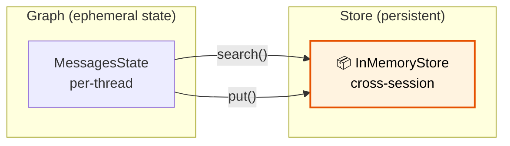

# 30 — Long-Term Memory

## What is long-term memory?

`BaseStore` provides a **persistent key-value store** that lives **outside** the graph's state. Data stored here survives across threads, sessions, and restarts.

## What you'll learn

- `InMemoryStore` — persistent key-value store
- `store.put(namespace, key, value)` — save data
- `store.search(namespace)` — query data
- Cross-session memory — remember user facts

## Key idea

State is per-thread and resets. Store is global and persists. Use store for user profiles, preferences, and long-term facts.
