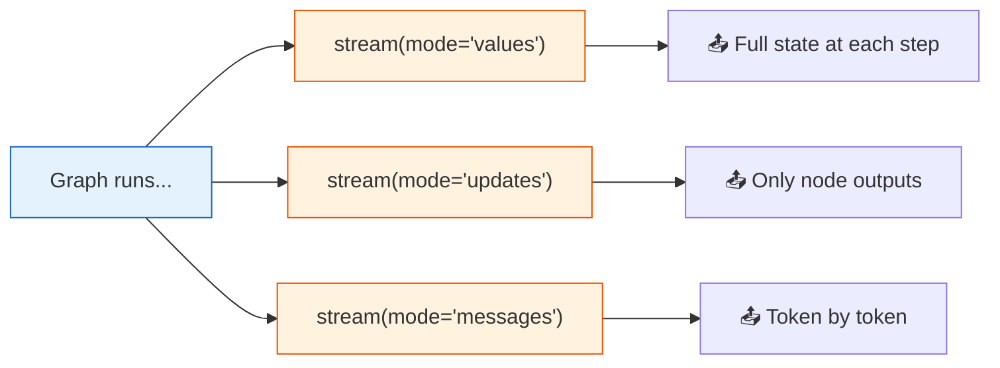

# 31 — Streaming

## What is streaming in LangGraph?

LangGraph supports **7 stream modes** that let you inspect graph execution as it happens — not just the final result.

## What you'll learn

- `stream(mode="values")` — full state each step
- `stream(mode="updates")` — only node output changes
- `stream(mode="messages")` — token-level streaming
- Comparing modes

## Key idea

`"values"` = complete picture. `"updates"` = what changed. `"messages"` = real-time tokens.
