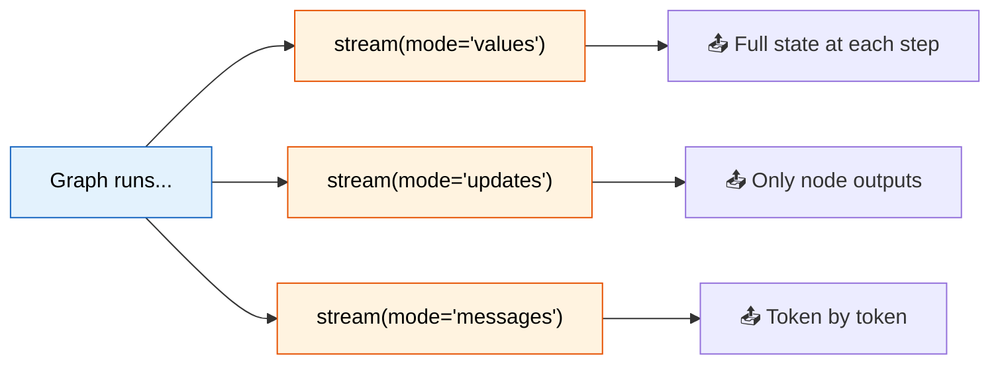

# 31 — Streaming

## What is streaming in LangGraph?

LangGraph supports **7 stream modes** that let you inspect graph execution as it happens — not just the final result.



## What you'll learn

- `stream(mode="values")` — full state each step
- `stream(mode="updates")` — only node output changes
- `stream(mode="messages")` — token-level streaming
- Comparing modes

## Code Walkthrough

```python
for chunk in graph.stream(input_msg, stream_mode="values"):
    msgs = chunk.get("messages", [])

for output in graph.stream(input_msg, stream_mode="updates"):
    for node_name, node_output in output.items():

for msg_meta, _ in graph.stream(input_msg, stream_mode="messages"):
    if hasattr(msg_meta, "content") and msg_meta.content:
        print(msg_meta.content, end="")
```

**What each mode does:**
- `stream_mode="values"` — Emits the **full state** after each node completes. Each chunk is a complete state dict. Use this to see the entire picture at every step. Best for debugging.
- `stream_mode="updates"` — Emits only the **changes** returned by each node. Each chunk is `{node_name: {updated_fields}}`. Use this to see what each node contributed, without the full state.
- `stream_mode="messages"` — Emits **each message** as it's generated, including **token-level chunks** from the LLM. The first element is the message chunk, second is metadata. Use this for real-time UI updates.
- `.stream()` vs `.invoke()` — `invoke()` waits for the full result. `stream()` yields intermediate results as they happen. Both return the same final state.

## Key idea

`"values"` = complete picture. `"updates"` = what changed. `"messages"` = real-time tokens.
