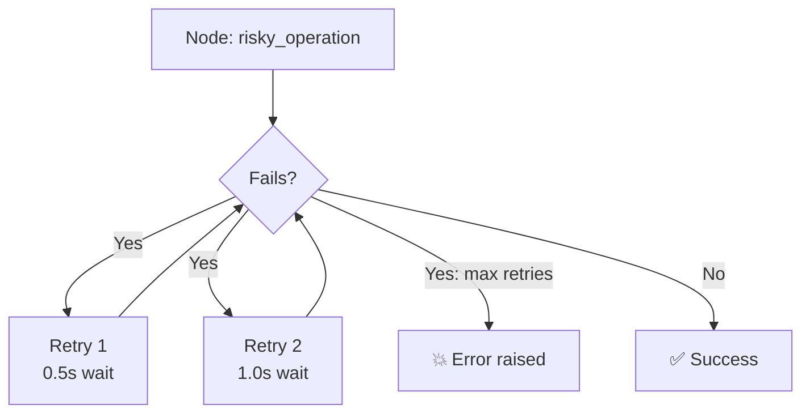

# 32 — Error Handling

## What is error handling?

LangGraph lets you configure `RetryPolicy` on nodes — if a node fails, it retries automatically with exponential backoff.



## What you'll learn

- `RetryPolicy` — `initial_interval`, `max_attempts`, `backoff_factor`
- Node-level retry via `add_node(..., retry=RetryPolicy(...))`
- `recursion_limit` — max steps before `GraphRecursionError`
- `NodeError` — inspect failures

## Code Walkthrough

```python
from langgraph.types import RetryPolicy

builder.add_node("risky", risky_node, retry=RetryPolicy(
    initial_interval=0.1, max_attempts=3, backoff_factor=2,
))

graph.invoke(input, {"recursion_limit": 10})
```

**What each piece does:**
- `RetryPolicy(initial_interval=0.1, max_attempts=3, backoff_factor=2)` — If the node raises an exception, retry it. First retry waits 0.1s, second waits 0.2s, third waits 0.4s (exponential backoff). After 3 failures, the exception propagates up.
- `add_node("risky", risky_node, retry=RetryPolicy(...))` — Attaches the retry policy to a **specific node**. Different nodes can have different policies.
- `recursion_limit=10` — Max number of graph steps before `GraphRecursionError`. Prevents infinite agent loops. Default is usually 25. Set it lower to fail fast during testing.
- `GraphRecursionError` — Raised when the graph exceeds `recursion_limit` steps. Common when an agent keeps calling tools without answering.
- `NodeError` — Wraps exceptions raised inside a node. Check `error.failed_node` to see which node failed.

## Key idea

Retry policies make agents resilient. Always set a `recursion_limit` to prevent infinite loops.
