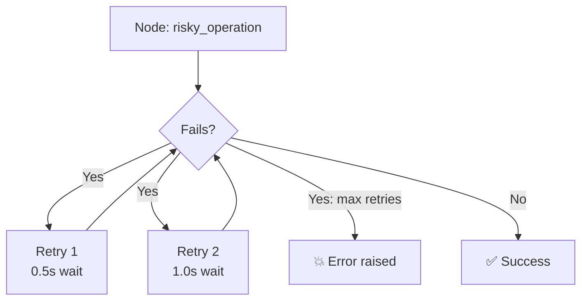

# 32 — Error Handling

## What is error handling?

LangGraph lets you configure `RetryPolicy` on nodes — if a node fails, it retries automatically with exponential backoff.

## What you'll learn

- `RetryPolicy` — `initial_interval`, `max_attempts`, `backoff_factor`
- Node-level retry via `add_node(..., retry=RetryPolicy(...))`
- `recursion_limit` — max steps before `GraphRecursionError`
- `NodeError` — inspect failures

## Key idea

Retry policies make agents resilient. Always set a `recursion_limit` to prevent infinite loops.
