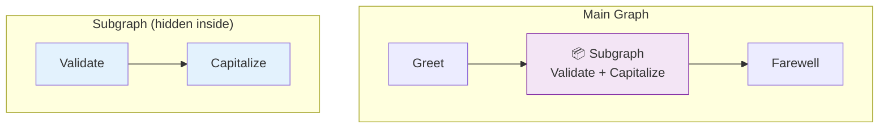

# 33 — Subgraphs

## What are subgraphs?

A subgraph is a **graph inside a graph**. You compile an inner `StateGraph` and add it as a node in the outer graph. The outer graph sees the subgraph as a single step, but internally it runs its own nodes and edges.

## What you'll learn

- Compile a `StateGraph` separately → subgraph
- Add subgraph as a node via `add_node(name, subgraph.compile())`
- The outer graph treats it as a single step

## Key idea

Subgraphs let you **compose** complex agents from reusable pieces. Each subgraph has its own internal state and logic.
